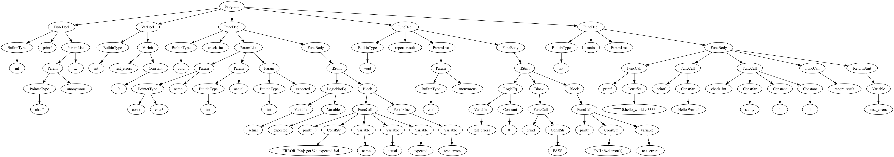

# `lcc`: Learn C Compiler

[](https://github.com/yanghuafang/lcc/actions/workflows/ci.yml)
[](LICENSE)

A teaching C compiler built with **flex**, **bison**, and **LLVM 20**.

`lcc` compiles one `.c` translation unit to a `.o` object file (`-i` and `-o` are both required), and optionally to assembly with `-S`. Link the object with `clang` or `gcc` to run the program.

## Why this project

| Trait | What it means |
| --- | --- |
| **Small enough to read** | A bottom-up **LALR** grammar (flex/bison) instead of a hand-written recursive-descent parser keeps the front-end short enough to study and modify. |
| **A real toolchain** | Emits genuine **LLVM 20** IR and native object files through `IRBuilder` and `TargetMachine` — not a toy backend. |
| **Cleanly layered** | `src/` is an acyclic dependency graph: `ast/` includes nothing outside itself, `irgen/` does not know the middle end or back end exist, and the phase ordering lives in one file (`driver/Pipeline.cpp`). You can study or change one layer at a time. |
| **Guided curriculum** | A 19-milestone learning plan (**M0–M18**) takes you from a first build to custom LLVM passes and codegen — see [docs/LearningPlan.md](docs/LearningPlan.md). |
| **Inspectable** | Dump AST graphs (Graphviz), pre/post-optimization IR, assembly, and IR / machine-instruction stats straight from the CLI. |

## How it works

```
.c source
  │  [front-end]   flex (Lexer.l) + bison (Parser.y)
  ▼
AST  (namespace AST, rooted at g_root)
  │  [front-end]   pipeline::genIr()
  ▼
LLVM IR  (llvm::Module, built with IRBuilder)
  │  [middle-end]  IrOptimizer::run()  — LLVM New PM: -O0..-Oz, -O-passes, custom passes
  ▼
Optimized IR  (+ DWARF when -g)
  │  [back-end]    TargetBackend  — llvm::TargetMachine
  ├──►  .o object file  (-o)
  └──►  .s assembly     (-S, optional — its own codegen pass, not derived from the .o)
```

<p align="center">
  <br>
  <sub>The front-end AST for <a href="tests/0.hello_world.c"><code>tests/0.hello_world.c</code></a>, dumped with <code>lcc -v out.dot</code> and rendered by Graphviz.</sub>
</p>

There is **no separate semantic-analysis pass**: C type information is resolved on demand during `genCode()`, using opaque pointers (pointee types live on the AST `VarType`, not on `llvm::Type*`). [docs/Architecture.md](docs/Architecture.md) walks the stages in detail and maps them to `src/` files; [docs/LlvmTools.md](docs/LlvmTools.md) shows how to inspect each one with LLVM tools.

## Quick start

```bash
git clone git@github.com:yanghuafang/lcc.git
cd lcc/scripts

# macOS: ./install-deps-macos.sh
# Ubuntu 24.04 / 26.04: ./install-deps-ubuntu.sh

./build-lcc.sh
./compile-tests.sh 0.hello_world.c
./link-tests.sh 0.hello_world.c
./run-tests.sh 0.hello_world.c
```

Expected output: `0.hello_world.c PASS`

Full regression suite:

```bash
./compile-tests.sh && ./link-tests.sh && ./run-tests.sh
```

Build artifacts go to `../../lcc-build/` (sibling of the repo). The AST graphs, IR, and assembly the tests produce land in `lcc/debug/`; [docs/Testing.md](docs/Testing.md) explains the file-name suffixes and the debug/release compile modes.

## Compile and run your own program

The Quick start above uses the test harness; under the hood it is a plain `compile → link → run` flow that works on any C file in the [supported subset](docs/Language.md). Since there is **no preprocessor**, declare the libc functions you use.

```c
// sum.c
int printf(char*, ...);

int main() {
  int total = 0;
  for (int i = 1; i <= 10; i++) {
    total += i;
  }
  printf("sum(1..10) = %d\n", total);
  return 0;
}
```

Save it as `/tmp/sum.c`, then from `lcc/scripts` (after `./build-lcc.sh`):

```bash
# 1. Compile C -> object with lcc
../../lcc-build/lcc -i /tmp/sum.c -o /tmp/sum.o

# 2. Link the object with the system toolchain
clang /tmp/sum.o -o /tmp/sum

# 3. Run it
/tmp/sum
# -> sum(1..10) = 55
```

`lcc` emits position-independent objects, so the same link step works on macOS and Linux without `-no-pie`.

Useful extra flags: `-O2` to optimize, `-g` for a debuggable build, `-S /tmp/sum.s` to also emit assembly, and `-v /tmp/sum.dot` to dump the AST graph. Full reference: [docs/Usage.md](docs/Usage.md).

## What it supports (summary)

- Types: builtin, struct, union, enum, `typedef`, and pointers
- 1D and 2D arrays, including brace and string initialization
- Functions (including variadic declarations), file- and block-scope `static`
- The full expression and statement grammar: operators, `sizeof`, casts, control flow, `break` / `continue`
- DWARF debug info under `-g`

**Not included:** preprocessor (`#include`, `#define`), 3D arrays, `extern` variables, block-scope `typedef`.

Details: [docs/Language.md](docs/Language.md)

## Repository layout

```
lcc/
├── src/               # Compiler sources; src/ is the only include root, so
│   │                  # every include names its directory ("ast/...", "irgen/...")
│   ├── driver/                  # the only place the phases meet
│   │   ├── main.cpp             # CLI parsing, flag validation
│   │   └── Pipeline.*           # walk -> optimize -> emit .o / .s
│   ├── frontend/                # the .l / .y that define the language
│   │   ├── Lexer.l              # flex lexer
│   │   └── Parser.y             # bison LALR grammar
│   ├── ast/                     # The tree, no LLVM knowledge
│   │   ├── Nodes.hpp            # Node hierarchy (Decl / Stmt / Expr / VarType)
│   │   ├── Ownership.cpp        # destructors: who deletes what
│   │   └── BuiltinTypeId.hpp    # C type enum, carries the signedness LLVM drops
│   ├── types/                   # What a type is; emits no instructions
│   │   ├── TypeEnv.hpp          # type environment interface (AST VarType -> llvm::Type)
│   │   ├── TypeRules.*          # C type rules: promotion, conversion, signedness
│   │   │                        # (constexpr in the .hpp; .cpp static_asserts them)
│   │   ├── BuiltinTypeMap.*     # C scalar width table: BuiltinTypeId -> llvm::Type
│   │   └── VarTypeQuery.*       # AST VarType -> BuiltinTypeId / llvm::Type queries
│   ├── irgen/                   # AST -> LLVM IR
│   │   ├── ExprToIr.cpp         # walker: variables, literals, calls, member access
│   │   ├── OperatorToIr.cpp     # walker: assign, arithmetic, inc/dec, bitwise, shift
│   │   ├── LogicToIr.cpp        # walker: &&, ||, !, comparisons, ?:
│   │   ├── ExprTypeQuery.cpp    # what type an Expr has (no instructions emitted)
│   │   ├── StmtToIr.cpp         # walker: statements, basic blocks, break/continue
│   │   ├── DeclToIr.cpp         # walker: declarations and their storage
│   │   ├── TypeToIr.cpp         # walker: AST VarType -> llvm::Type
│   │   ├── Operators.*          # one function per C operator (arithmetic, bitwise, compare)
│   │   ├── TypeConversion.*     # emits C conversions (pairs with types/TypeRules)
│   │   ├── IrIdioms.*           # alloca, block terminator, load/store
│   │   ├── Arrays.*             # array bounds, the type they build, brace/string init
│   │   ├── StaticLocal.*        # block-scope static: module global + lazy-init guard
│   │   ├── SymbolTable.*        # scoped name lookup (no IR emitted)
│   │   ├── ControlFlowContext.* # where break and continue jump to
│   │   ├── CodeGenerator.*      # LLVM context/module; composes the two above
│   │   └── DebugInfoBuilder.*   # DWARF debug info (-g)
│   ├── opt/                     # middle-end (LLVM New Pass Manager)
│   │   ├── IrOptimizer.*        # pass pipeline
│   │   └── passes/              # lcc's own IR passes (IR stats, fold-add-zero)
│   ├── backend/                 # back-end (.o / .s emission)
│   │   ├── TargetBackend.*      # TargetMachine setup, legacy-PM codegen
│   │   └── passes/              # lcc's own MIR passes (machine stats)
│   ├── dot/                     # AST -> Graphviz DOT, independent of irgen/
│   │   ├── AstToDot.cpp         # genGraph() for every node (-v)
│   │   └── DotFileWriter.*      # writes the assembled DOT graph to disk
│   └── generated/               # flex/bison output — never edit (Lexer.cpp, Parser.*)
├── tests/             # 41 suite programs (+1 study fixture); each prints "<name> PASS" or "FAIL"
│   └── graphs/        # Assertion-free fixtures, one per language area, for AST graphs only
├── benchmarks/        # Larger workloads for bench.sh (M15)
├── scripts/           # build-lcc.sh, compile/link/run-tests.sh, format.sh, tidy.sh, bench
├── docs/              # Guides (start with LearningPlan.md)
├── debug/             # Committed IR / asm goldens for the suite; AST graphs in debug/graphs/
├── CMakeLists.txt     # flex/bison codegen + LLVM configuration
└── LICENSE            # MIT
```

## Documentation

| Guide | Topics |
| ------- | -------- |
| [docs/LearningPlan.md](docs/LearningPlan.md) | **Start here** — full learning path (M0–M18) |
| [docs/Architecture.md](docs/Architecture.md) | `src/` file map and where to make a given change |
| [docs/LlvmTools.md](docs/LlvmTools.md) | LLVM tool reference and per-milestone case studies (M7–M9, M12–M15, M17) |
| [docs/Install.md](docs/Install.md) | Dependencies, build `lcc`, CMake options |
| [docs/Usage.md](docs/Usage.md) | CLI flags, link, debug compiled programs |
| [docs/Testing.md](docs/Testing.md) | Test scripts, compile modes, CI smoke checks |
| [docs/Benchmarks.md](docs/Benchmarks.md) | Benchmark harness, workloads, recording opt results (M15) |
| [docs/DebuggingLcc.md](docs/DebuggingLcc.md) | Debug `lcc` in VS Code / LLDB |
| [docs/Language.md](docs/Language.md) | Full feature list and limitations |
| [docs/ParserConflicts.md](docs/ParserConflicts.md) | Bison parser conflicts |
| [docs/FrontendNotes.md](docs/FrontendNotes.md) | How the front-end reached its current feature set; deferred language work |
| [docs/MiddleBackendNotes.md](docs/MiddleBackendNotes.md) | What each middle/back-end milestone built, with acceptance criteria |

[docs/README.md](docs/README.md) indexes the same guides with a milestone-to-doc map.

## Requirements

**macOS** (Homebrew) or **Ubuntu 24.04 / 26.04 LTS**, with:

| Needed | Note |
| --- | --- |
| LLVM **20**, CMake **3.22+**, **C++17** | |
| flex, bison | required at **configure** time — CMake regenerates the lexer and parser on every run |
| a system linker (`clang` or `gcc`) | links lcc's PIC objects |
| argparse | used if installed; CMake downloads it otherwise |
| graphviz | supplies `dot`, which the test scripts call to render AST images |

Setup commands: [docs/Install.md](docs/Install.md).

## Project status

Front-end language work (arrays through `-g` debug info) is **complete** ([docs/FrontendNotes.md](docs/FrontendNotes.md)), and so is the **M0–M18** learning plan ([docs/LearningPlan.md](docs/LearningPlan.md)).

Exploratory ideas for later — real diagnostics, more C language features, and deeper optimization/back-end passes — are recorded as **unscheduled future directions** (no milestones attached) in [docs/FrontendNotes.md](docs/FrontendNotes.md#future-directions-no-milestones) and [docs/MiddleBackendNotes.md](docs/MiddleBackendNotes.md#future-directions-no-milestones).

## Contributing

Contributions are welcome — bug fixes, new test programs, documentation, and milestone work. Please read [CONTRIBUTING.md](CONTRIBUTING.md) for the build, test, and coding-style workflow, and run the full `compile → link → run` suite before opening a pull request.

## License

`lcc` is released under the **MIT License** — see [LICENSE](LICENSE).
