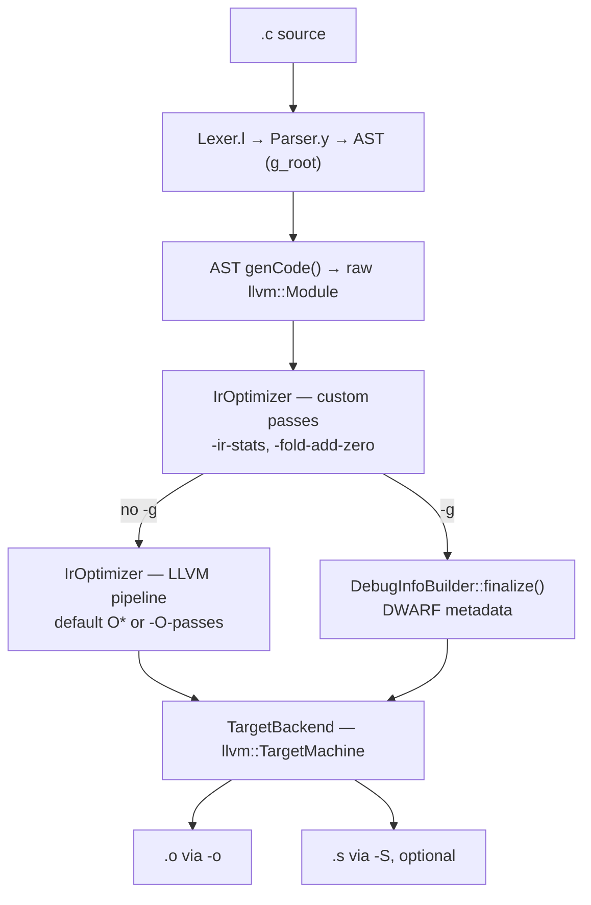

# Source tree architecture

The stage diagram and a map from `src/` files to responsibilities, for orienting before you read code. For what each milestone builds, see [LearningPlan.md](LearningPlan.md); for how to inspect a stage with LLVM tools, see [LlvmTools.md](LlvmTools.md).

## Stages

This is the canonical stage diagram for `lcc`; other docs link here rather than redraw it.

`main.cpp` drives `CodeGenerator` in order: `genIrCode()` builds and optimizes the module, `genObjectCode()` always emits the `-o` object, and `genAssemblyCode()` emits `.s` only if `-S` was given.

`lcc` is **single-pass**: there is no separate semantic-analysis or lowering pass. Each AST node emits its own IR from `genCode()`, using the shared state on `CodeGenerator`.

Three details the diagram flattens:

- **`DebugInfoBuilder` is not a stage that the module passes through.** Under `-g` it is constructed and initialized *before* `genCode()` and accumulates DWARF metadata *during* the AST walk; only `finalize()` runs where the diagram shows it.
- **The `-g` branch is a branch because `-g` blanks `-O` and `-O-passes`** so that `dbg.declare` allocas survive; the custom passes still run either way. See [Usage.md § Optimization levels](Usage.md#optimization-levels--o).
- **`.o` and `.s` each run their own codegen pipeline** over the same module, so assembly is not derived from the object file. Legacy-PM codegen mutates that module, which is why `main` dumps `-l` between the two.

## Files

| File | Responsibility |
|------|----------------|
| `main.cpp` | CLI parsing (`argparse`), flag validation, wiring `CodeGenerator` and `TargetBackendOptions` |
| `Lexer.l` | flex rules: tokens, literal parsing (int/float/hex suffixes), keywords |
| `Parser.y` | bison LALR grammar, precedence table, AST construction |
| `AbstractSyntaxTree.hpp` | AST node class hierarchy (`Node` → `Decl` / `Stmt` / `Expr` / `VarType`) |
| `AbstractSyntaxTree.cpp` | `genCode()` for every node — by far the largest file, and the bulk of IR generation |
| `CodeGenerator.cpp` / `.hpp` | Shared context: `LLVMContext`, `IRBuilder`, `Module`, and scoped symbol tables for variables, types, typedef aliases, constants, and function signatures |
| `Utils.cpp` / `.hpp` | IR-building helpers: casts, type promotion, comparisons, arithmetic lowering, entry-block allocas |
| `Types.hpp` | `BuiltinTypeId` — records C signedness, which LLVM integer types do not carry |
| `DebugInfoBuilder.cpp` | DWARF via `DIBuilder` when `-g` is set |
| `IrOptimizer.cpp` | Middle-end: custom passes plus `PassBuilder` default or `-O-passes` pipeline |
| `TargetBackend.cpp` | `TargetMachine` setup and `.o` / `.s` emission (legacy PM) |
| `Visualizer.cpp` | `genGraph()` — Graphviz DOT output for `-v` |
| `passes/IrInstructionStatsPass.cpp` | M6: New PM function pass, load/store/call counts (reads only) |
| `passes/FoldAddZeroPass.cpp` | M7: New PM transform, `add %x, 0` → `%x` |
| `passes/MachineInstrStatsPass.cpp` | M17: legacy `MachineFunctionPass` counting final MIR |

`Lexer.cpp`, `Parser.cpp`, and `Parser.hpp` are **generated** from `Lexer.l` and `Parser.y` — edit the `.l` / `.y` sources instead. CMake runs `flex` and `bison` in `src/` at configure time and fails if either tool is missing, so both are build requirements even though the outputs are committed; expect the generated files to appear as local modifications after a build. `Parser.output` and `Parser.counterexamples` are generated reports; see [ParserConflicts.md](ParserConflicts.md).

## Where to make a change

| Goal | Start in |
|------|----------|
| New token or literal form | `Lexer.l` |
| New syntax | `Parser.y`, then a node in `AbstractSyntaxTree.hpp` / `.cpp` |
| Different IR for existing syntax | that node's `genCode()` in `AbstractSyntaxTree.cpp`, or a helper in `Utils.cpp` |
| New IR pass | `passes/`, registered in `IrOptimizer.cpp` |
| New machine pass | `passes/`, spliced in `TargetBackend.cpp` |
| New CLI flag | `main.cpp`, then document in [Usage.md](Usage.md) |
| Debug info | `DebugInfoBuilder.cpp` |
| AST rendering | `Visualizer.cpp` |

## Related docs

- [LearningPlan.md](LearningPlan.md) — milestones M0–M18
- [LlvmTools.md](LlvmTools.md) — stage-by-stage behavior and LLVM tool recipes
- [MiddleBackendNotes.md](MiddleBackendNotes.md) — middle/back-end design notes
- [ParserConflicts.md](ParserConflicts.md) — grammar conflicts in `Parser.y`
- [Language.md](Language.md) — the C subset the front-end accepts
