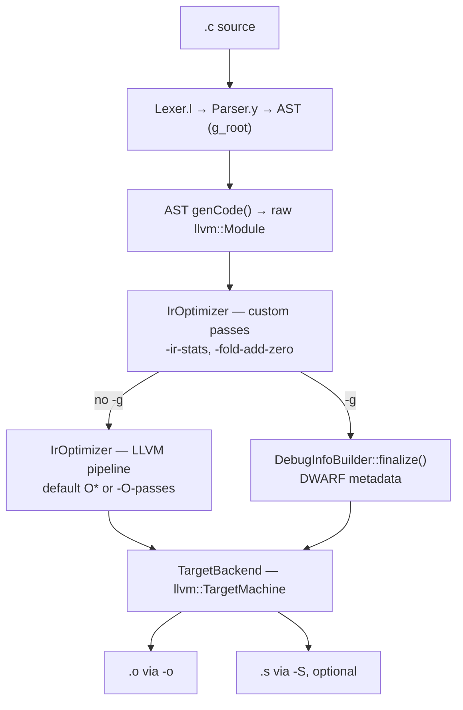

# Source tree architecture

The stage diagram and a map from `src/` files to responsibilities, for orienting before you read code. For what each milestone builds, see [LearningPlan.md](LearningPlan.md); for how to inspect a stage with LLVM tools, see [LlvmTools.md](LlvmTools.md).

## Stages

This is the canonical stage diagram for `lcc`; other docs link here rather than redraw it.



`driver/main.cpp` drives `CodeGenerator` in order: `pipeline::genIr()` builds and optimizes the module, `pipeline::emitObject()` always emits the `-o` object, and `pipeline::emitAssembly()` emits `.s` only if `-S` was given.

`lcc` is **single-pass**: there is no separate semantic-analysis or lowering pass. Each AST node emits its own IR from `genCode()`, using the shared state on `CodeGenerator`.

Three details the diagram flattens:

- **`DebugInfoBuilder` is not a stage that the module passes through.** Under `-g` it is constructed and initialized *before* `genCode()` and accumulates DWARF metadata *during* the AST walk; only `finalize()` runs where the diagram shows it.
- **The `-g` branch is a branch because `-g` blanks `-O` and `-O-passes`** so that `dbg.declare` allocas survive; the custom passes still run either way. See [Usage.md § Optimization levels](Usage.md#optimization-levels--o).
- **`.o` and `.s` each run their own codegen pipeline** over the same module, so assembly is not derived from the object file. Legacy-PM codegen mutates that module, which is why `main` dumps `-l` between the two.

## Files

`src/` is the only include root, so every lcc include names the directory it
reaches into — `#include "ast/Nodes.hpp"`, never `#include "Nodes.hpp"`. Which
layer a translation unit depends on is therefore visible in its include block,
and an unwanted edge shows up in review rather than hiding behind a bare
filename.

Two naming rules hold throughout, so a name tells you where its definition
lives.

**A file is named for what it contains**, not for the directory that already
says it — `ast/Nodes.hpp`, not `ast/AbstractSyntaxTree.hpp`.

**A module's namespace is a short form of its file name**, never of its
directory. The namespace is what you read at a call site, so it is kept short;
the file name is the unabbreviated version of the same idea:

| Namespace | File |
| ------ | ---------------- |
| `convert::` | `irgen/TypeConversion.hpp` |
| `ops::` | `irgen/Operators.hpp` |
| `iridiom::` | `irgen/IrIdioms.hpp` |
| `arrayinit::` | `irgen/ArrayInitializer.hpp` |
| `staticlocal::` | `irgen/StaticLocal.hpp` |
| `vartype::` | `types/VarTypeQuery.hpp` |
| `typerules::` | `types/TypeRules.hpp` |
| `dotfile::` | `dot/DotFileWriter.hpp` |

This is why the modules under `types/` and `irgen/` each carry their own
namespace rather than a shared `types::` or `irgen::`: the prefix at a call site
names the one file to open, which a directory-wide namespace could not do.

| Directory | Role |
| ------ | ---------------- |
| `driver/` | CLI parsing and the phase ordering — the only place the phases meet |
| `frontend/` | flex and bison sources — the `.l` / `.y` that define the language |
| `ast/` | The node hierarchy and the tree's ownership contract. Knows nothing about LLVM |
| `types/` | The C type system: what a type *is*. Emits no instructions |
| `irgen/` | AST → LLVM IR lowering, plus the shared context the lowering threads through |
| `opt/` | Middle-end: the pass pipeline and lcc's own New PM IR passes |
| `backend/` | `TargetMachine`, object/assembly emission, and MIR-level passes |
| `dot/` | AST → Graphviz DOT — a second consumer of the same tree, independent of `irgen/` |
| `generated/` | flex and bison output, never edited by hand |

The library layers form a DAG whose arrows all point downward, with `driver/`
alone on top:

```
                     driver/  (main.cpp + Pipeline)
                    ╱    │    │    ╲
              irgen/    opt/  backend/   dot/
                 │                        │
              types/                      │
                 │                        │
                ast/ ◄─────────────────────
```

| Layer | Depends on |
| ------ | ---------------- |
| `ast/` | nothing — not even `types/` |
| `types/` | `ast/` |
| `irgen/` | `ast/`, `types/` |
| `opt/`, `backend/` | LLVM only |
| `dot/` | `ast/` |
| `driver/` | all of the above |

Two properties are worth stating because they are easy to lose:

- **No back edges.** `ast/` includes nothing outside `ast/`, so the tree can be
  built and destroyed without any of the code that lowers it — including
  `VarInit`'s array-type chain, which `ast/Ownership.cpp` releases itself.
- **`irgen/` does not know the middle end or back end exist.** `CodeGenerator`
  is the context an AST walk calls into, nothing more; the sequence "walk →
  optimize → emit" lives only in `driver/Pipeline.cpp`. Put that sequence back
  on `CodeGenerator` and every AST walker starts including `TargetBackend.hpp`
  transitively, which is what it used to do.

### `driver/` — CLI and phase ordering

| File | Responsibility |
| ------ | ---------------- |
| `driver/main.cpp` | CLI parsing (`argparse`), flag validation, and the `IrCodeGenOptions` / `TargetBackendOptions` it fills in |
| `driver/Pipeline.cpp` / `.hpp` | `namespace pipeline` — `genIr` (AST walk + middle end), `emitObject`, `emitAssembly`, `dumpIr`. The stage diagram above in executable form. Note that `genIr` takes the whole `CodeGenerator` while everything after it takes only an `llvm::Module`: once the module exists, nothing downstream cares where it came from |

### `frontend/` — flex and bison

| File | Responsibility |
| ------ | ---------------- |
| `frontend/Lexer.l` | flex rules: tokens, literal parsing (int/float/hex suffixes), keywords |
| `frontend/Parser.y` | bison LALR grammar, precedence table, AST construction |

### `ast/` — the tree

| File | Responsibility |
| ------ | ---------------- |
| `ast/Nodes.hpp` | AST node class hierarchy (`Node` → `Decl` / `Stmt` / `Expr` / `VarType`) |
| `ast/Ownership.cpp` | Destructors for every node — the tree's ownership contract, so `delete Program` tears down one translation unit |
| `ast/BuiltinTypeId.hpp` | The `AST::BuiltinTypeId` enum — records C signedness, which LLVM integer types do not carry. Lives here, not in `types/`, because the AST nodes are what carry it; `types/` builds its rules on top |

### `types/` — what a type is

| File | Responsibility |
| ------ | ---------------- |
| `types/TypeEnv.hpp` | Abstract interface: the type environment an AST `VarType` needs to become an `llvm::Type` (context, tag/typedef lookup, aggregate mapping, sizes). Excludes `IRBuilder`, so resolving a type cannot emit instructions |
| `types/TypeRules.cpp` / `.hpp` | `namespace typerules` — C type rules LLVM cannot express: signedness predicates, integer promotion, usual arithmetic conversion. A leaf: pure functions over `BuiltinTypeId`, with no LLVM or AST dependency |
| `types/VarTypeQuery.cpp` / `.hpp` | `namespace vartype` — what type an AST node denotes: `VarType` → `BuiltinTypeId`, typedef resolution, and the pointee/element types that opaque pointers force load/store/GEP to read from the AST. Emits no instructions |

### `irgen/` — AST to LLVM IR

`irgen/` is **one walker per node category, the emission services, `DebugInfoBuilder`, two bookkeeping subsystems, and one shared context.**

The walk is split by node category — the same `Decl` / `Stmt` / `Expr` / `VarType` taxonomy the grammar and `ast/Nodes.hpp` already use, so the file to open follows from the kind of node you are chasing. `Expr` is several files rather than one, because C's expression grammar is the largest part of the language. All of them define members of classes declared in `ast/Nodes.hpp`, so none of them has a header of its own.

| Walker | Responsibility |
| ------ | ---------------- |
| `irgen/ExprToIr.cpp` | `genCode()` / `genCodePtr()` for the `Expr` nodes that name or produce a value directly: variables, literals, calls, member access, subscript, cast, `sizeof`, unary |
| `irgen/OperatorToIr.cpp` | Assignment, arithmetic, increment/decrement, bitwise, shift. Each operator and its compound-assignment twin share one `ops::` function, called from `genBinaryCode` / `genCompoundAssignPtr` |
| `irgen/LogicToIr.cpp` | `&&`, `\|\|`, `!`, the six comparisons, and `?:` — the operators whose result is `int` regardless of operand type. Also where lcc's three documented deviations from C live: `&&`, `\|\|`, and `?:` are lowered eagerly with `select` |
| `irgen/ExprTypeQuery.cpp` | The `getExpr*` / `getLValue*` queries for every `Expr` node — lcc's stand-in for a semantic-analysis pass. Answers what type an expression *has*; emits no instructions, which is why it is separate from `ExprToIr.cpp`, `OperatorToIr.cpp` and `LogicToIr.cpp` |
| `irgen/StmtToIr.cpp` | `genCode()` for every `Stmt` node, plus `FuncBody` (a statement list). Where lcc's basic-block structure is built: if/else joins, loop header/body/latch, switch dispatch, break/continue targets |
| `irgen/DeclToIr.cpp` | `genCode()` for `Program`, `FuncDecl`, `VarDecl`, `TypeDecl`, `TypedefDecl`. `VarDecl::genCode` reads as a decision table — resolve bounds, build the nested `ArrayType`, pick storage, initialize — and delegates the initializing itself to `irgen/Arrays.cpp` and `irgen/StaticLocal.cpp` |
| `irgen/TypeToIr.cpp` | `VarType::getType()` for each type node — builtin, pointer, array, struct, union, enum, typedef alias. Materialization only; emits no instructions |

The services below are called from any of the seven, which is why they have headers and the walkers do not.

| Service | Responsibility |
| ------ | ---------------- |
| `irgen/Operators.cpp` / `.hpp` | `namespace ops` — one function per C binary operator (arithmetic, bitwise/shift, comparison), each shared by the operator and its compound-assignment twin |
| `irgen/TypeConversion.cpp` / `.hpp` | `namespace convert` — emits C's conversions: casts, promotions, and the usual arithmetic conversions applied to an operand pair. The emission half of `types/TypeRules.hpp`, which decides what those conversions should be |
| `irgen/IrIdioms.cpp` / `.hpp` | `namespace iridiom` — the IR shapes lcc repeats: entry-block alloca, guarded block terminator, load/store through an lvalue |
| `irgen/ArrayInitializer.cpp` / `.hpp` | `namespace arrayinit` — array declarator bound inference, and the four array initializer shapes: local/global x brace/string. A global initializer is *assembled* as an `llvm::Constant`, a local one *emitted* as GEP/store pairs |
| `irgen/StaticLocal.cpp` / `.hpp` | `namespace staticlocal` — block-scope `static`: one module global per (function, name), plus the lazy-init guard that splits a basic block when the initializer is not constant. The only place a *declaration* creates control flow |
| `irgen/DebugInfoBuilder.cpp` / `.hpp` | DWARF via `DIBuilder` when `-g` is set |

Two of those are pure bookkeeping — they record what the walk has seen and emit no IR at all, which is what makes them readable, and testable, without a compiler around them.

| Subsystem | Responsibility |
| ------ | ---------------- |
| `irgen/SymbolTable.cpp` / `.hpp` | C's name lookup: a stack of scopes walked innermost-outward, so an inner declaration shadows an outer one. Variables, functions, types, and enum constants share one map discriminated by a tag; typedef aliases get their own, so a typedef name and a variable of the same name do not collide. Also the unscoped `llvm::StructType*` → AST registries that member access reads back, and the recorded function signatures a call site casts against. `ScopedSymbolTable` lives here, beside the stack it balances |
| `irgen/ControlFlowContext.cpp` / `.hpp` | Where `break` and `continue` jump to. Neither statement carries a target, so a loop pushes both and a switch pushes only the break target; each statement reads the innermost entry. This is why nesting a loop inside a switch inside a loop needs no special handling in `StmtToIr.cpp` |

| Context | Responsibility |
| ------ | ---------------- |
| `irgen/CodeGenerator.cpp` / `.hpp` | What genuinely needs LLVM: `LLVMContext`, `IRBuilder`, `Module`, the function currently being emitted, and the global-initializer insert point. Composes `SymbolTable` and `ControlFlowContext`, reached through `symbols()` and `controlFlow()`. Implements `TypeEnv` — those overrides forward into `symbols()` so that `types/` and the irgen services never have to know a `SymbolTable` exists |

### `opt/` and `backend/` — middle end and back end

| File | Responsibility |
| ------ | ---------------- |
| `opt/IrOptimizer.cpp` / `.hpp` | Middle-end: custom passes plus `PassBuilder` default or `-O-passes` pipeline |
| `opt/passes/IrInstructionStatsPass.cpp` | M6: New PM function pass, load/store/call counts (reads only) |
| `opt/passes/FoldAddZeroPass.cpp` | M7: New PM transform, `add %x, 0` → `%x` |
| `backend/TargetBackend.cpp` / `.hpp` | `TargetMachine` setup and `.o` / `.s` emission (legacy PM) |
| `backend/passes/MachineInstrStatsPass.cpp` | M17: legacy `MachineFunctionPass` counting final MIR. Under `backend/` because it runs on MIR, not IR |

### `dot/` — AST rendering

| File | Responsibility |
| ------ | ---------------- |
| `dot/AstToDot.cpp` | `genGraph()` for every node — the Graphviz DOT fragments behind `-v` |
| `dot/DotFileWriter.cpp` / `.hpp` | `namespace dotfile` — writes the assembled DOT graph to disk |

Everything **generated** lives in `src/generated/` and is never edited by hand: `Lexer.cpp` from `frontend/Lexer.l`, plus `Parser.cpp` / `Parser.hpp` and the `Parser.output` / `Parser.counterexamples` reports from `frontend/Parser.y` — edit the `.l` / `.y` sources instead. The destination is set by `%option outfile` in `Lexer.l` and `%output` in `Parser.y`; both are relative to `src/`, which is the directory CMake runs `flex` and `bison` from, so the tools are invoked as `flex frontend/Lexer.l` and the output still lands in `src/generated/`. CMake runs `flex` and `bison` at configure time and fails if either tool is missing, so both are build requirements even though the outputs are committed. The committed bytes are exactly what the tools emit, so a build leaves the tree clean — `src/generated/.clang-format` sets `DisableFormat` to keep it that way. Reformatting these files would be reverted by the next build and would show up as thousands of lines of phantom local modifications, so never hand-format them. For the reports, see [ParserConflicts.md](ParserConflicts.md).

## Where to make a change

| Goal | Start in |
| ------ | ---------- |
| New token or literal form | `frontend/Lexer.l` |
| New syntax | `frontend/Parser.y`, then a node in `ast/Nodes.hpp`, its `genCode()` in the matching `irgen/*ToIr.cpp`, and its destructor in `ast/Ownership.cpp` |
| Different IR for existing syntax | that node’s `genCode()` in the matching `irgen/*ToIr.cpp`, an operator in `irgen/Operators.cpp`, a conversion in `irgen/TypeConversion.cpp`, or an IR idiom in `irgen/IrIdioms.cpp` |
| What type an expression has | `irgen/ExprTypeQuery.cpp`, or `types/VarTypeQuery.cpp` if the question is about a `VarType` rather than an `Expr` |
| Scope or name lookup | `irgen/SymbolTable.cpp` |
| `break` / `continue` targets | `irgen/ControlFlowContext.cpp` |
| Array bounds or an array initializer | `irgen/ArrayInitializer.cpp` |
| Block-scope `static` | `irgen/StaticLocal.cpp` |
| New IR pass | `opt/passes/`, registered in `opt/IrOptimizer.cpp` |
| New machine pass | `backend/passes/`, spliced in `backend/TargetBackend.cpp` |
| New CLI flag | `driver/main.cpp`, then document in [Usage.md](Usage.md) |
| Debug info | `irgen/DebugInfoBuilder.cpp` |
| AST rendering | `dot/AstToDot.cpp` |

## Related docs

- [LearningPlan.md](LearningPlan.md) — milestones M0–M18
- [LlvmTools.md](LlvmTools.md) — stage-by-stage behavior and LLVM tool recipes
- [MiddleBackendNotes.md](MiddleBackendNotes.md) — middle/back-end design notes
- [ParserConflicts.md](ParserConflicts.md) — grammar conflicts in `Parser.y`
- [Language.md](Language.md) — the C subset the front-end accepts
