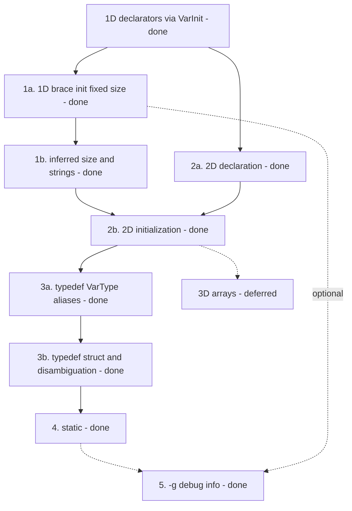

# Front-end & language notes

This document is a **completed record** of how lcc's **C language and front-end** support was built, ordered by **dependencies**, **learning value**, and **risk**. Read it for background on why the front-end looks the way it does; for what the compiler accepts today, see [Language.md](Language.md).

**Status:** priorities 1–5 below are **complete** (arrays through `-g` debug info). Deferred language work (3D arrays, preprocessor, `extern`) stays under [Explicitly out of scope](#explicitly-out-of-scope-for-now).

**The middle-end, optimization, and back-end track** that followed this one is likewise complete: milestones M0–M18 in [LearningPlan.md](LearningPlan.md), implementation details in [MiddleBackendNotes.md](MiddleBackendNotes.md).

lcc is a teaching compiler: each step should add one clear idea (grammar, AST, codegen, or LLVM metadata) without rewriting the whole pipeline.

## What lcc already has

Before extending, it helps to know what the current codebase already supports:

| Area | Status |
| ------ | -------- |
| 1D array declaration | `int a[10];` through `VarType` + `VarList`; bounds on each `VarInit` (`ArrayBoundList`) |
| Mixed array/scalar lists | `int a[4], b;` in one declaration (`tests/30.array_mixed_decl.c`) |
| Array indexing | `arr[i]` via `Subscript` and `ArrayType` |
| Scalar initialization | `int x = 1;` in `VarDecl::genCode` (local `store`, global `Constant`) |
| 1D fixed-size brace initialization | `int a[4] = {1,2,3};`, `{}` zero-fill, global/local (`tests/31.array_1d_brace_init.c`) |
| Inferred `[]` and string literal init | `int a[] = {…}`, `char s[] = "hello"`, `char s[N] = "…"` (`tests/32.array_1d_inferred_string_init.c`) |
| 2D array declaration | `int m[8][5];`, `m[i][j]`, struct grids, mixed lists (`tests/33.array_2d_decl.c`) |
| 2D array brace initialization | nested/flat init, `int a[][5] = {…}` (`tests/34.array_2d_brace_init.c`) |
| `typedef` of `VarType` spellings | `typedef unsigned long size_t;`, pointer/builtin aliases (`tests/35.typedef_builtin.c`) |
| `typedef` struct aliases / disambiguation | struct tag refs, combined `typedef struct S {…} S;`, typedef/variable conflicts (`tests/36.typedef_struct.c`) |
| File-scope `static` | TU-local variables and functions via `InternalLinkage` (`tests/37.static_file.c`) |
| Block-scope `static` | Mangled module globals, one-time init (`tests/38.static_local.c`) |
| User-defined types | `struct`, `union`, `enum` with tag names (`DefinedType` lookup) |
| Type names in expressions | `_VarType: IDENTIFIER` for registered tags and typedef aliases |
| `-g` CLI flag | Parsed in `driver/main.cpp`; passed to `CodeGenerator` — emits compile unit, stepping, locals/params, struct members, and lexical blocks; skips LLVM opts when set |
| **LLVM 20** toolchain | Opaque pointers in IR; pointee types tracked on AST `VarType` (`vartype::memoryAccessType`, etc.); requires C++17 |

See [ParserConflicts.md](ParserConflicts.md) for parser ambiguities that several of these steps had to work around (especially `typedef`).

---

## Recommended order (summary)

| Priority | Feature | Effort | Why this order |
| ---------- | --------- | -------- | ---------------- |
| **—** | [Array declarators](#array-extension-plan) (done) | Small | Unified `VarInit` + `ArrayBoundList`; foundation for init and multidim |
| **1** | [1D array initialization](#1-1d-array-initialization) (done) | Medium | Brace init, inferred `[]`, string literals |
| **2** | [2D arrays](#2-2d-and-3d-arrays) (done) | Medium | 2a declaration + 2b initialization; reuses 1D init helpers |
| **3** | [`typedef` and `size_t`](#3-typedef-and-size_t) (done) | Medium–large | 3a + 3b complete; cleaner API-style tests after arrays |
| **—** | [3D arrays](#3d-arrays-deferred) | — | Deferred; 2D covers teaching goals for now |
| **4** | [`static`](#4-static) (done) | Medium | 4a + 4b complete |
| **5** | [`-g` debug info](#5--g-debug-info) (done) | Medium–large | LLVM `DIBuilder` |

Sub-steps are lettered within their priority: **1a/1b** under priority 1, **2a/2b** under priority 2, and so on.

---

## Dependency overview



---

## Array extension plan

C array initialization is intentionally split into small merges. **2D is complete; 3D is deferred.** Support legal forms in tiers; reject illegal forms (e.g. `char s[5] = "hello"`, `int a[][]`) once the matching feature is in scope.

| Step | Delivers | Tests (examples) |
| ------ | ---------- | ------------------ |
| **Declarators** (done) | `ArrayBound` / `ArrayBoundList` on `VarInit`; one `VarDecl` path; `int a[4], b;` | `tests/30.array_mixed_decl.c` |
| **1a** (done) | `int a[4] = {1,2,3};` — zero-fill, global/local | `tests/31.array_1d_brace_init.c` |
| **1b** (done) | `int a[] = {…};`, `char s[] = "hello";`, `char s[6] = "hello";` | `tests/32.array_1d_inferred_string_init.c`; reject `char s[5] = "hello"` |
| **2a** (done) | `int a[8][5];`, subscript `a[i][j]` | `tests/33.array_2d_decl.c` |
| **2b** (done) | nested/flat init, `int a[][5] = {…}`, partial rows | `tests/34.array_2d_brace_init.c`; reject `int a[][]`, `int b[8][]` |
| **3D arrays** | *deferred* | Declaration and initialization — not planned near-term |

Grammar symbols: `VarInit`, `ArrayBound`, `ArrayBoundList` (see `Parser.y`). `arrays::buildVarType()` nests `ArrayType` for each bound (innermost bound last in the declarator list).

### Declarator unification (done)

- Removed the special-case `VarDecl` production that parsed `VarType IDENTIFIER [ INTEGER ] ;` alone.
- Array bounds live on each `VarInit`; `VarDecl::genCode` builds the effective type per variable.
- Scalar `= Expr` on arrays is rejected; use brace initialization for arrays.

---

## 1. 1D array initialization

Steps **1a** and **1b** are done. See [Array extension plan](#array-extension-plan).

### 1a — fixed-size brace initialization (done)

**Goal:**

```c
int arr[4] = {10, 7, 8, 9};   /* unspecified elements are zero */
int buf[3] = {1, 2, 3};
```

- `InitList` on `VarInit`; `= { … }` and `= {}` in `Parser.y` (`%prec COMMA` so commas are not parsed as the comma operator).
- `arrays::buildBraceInitializer` for globals, `arrays::storeBraceInitializer` for locals; zero-fill; reject too many elements.
- `tests/31.array_1d_brace_init.c`.

### 1b — inferred size and string literals (done)

**Goal:**

```c
int arr[] = {10, 7, 8, 9, 1, 5};
char s1[] = "hello";
char s2[6] = "hello";
```

- `ArrayBound`: `LBRACKET RBRACKET` stores `kInferredArrayBound`; `resolveBounds` infers length from brace list or string (`strlen + 1`).
- String init copies bytes plus `'\0'` into the char array; rejects initializer longer than the declared bound.

**Errors:** `char s3[5] = "hello";` (initializer too long).

### Why before multidimensional init

1D flattening and zero-fill helpers are reused for 2D/3D brace initialization in steps 2b and 3b.

---

## 2. 2D and 3D arrays

Covers steps **2a** and **2b** (done); 3D is deferred — see [3D arrays (deferred)](#3d-arrays-deferred).

### 2a — 2D declaration (done)

```c
int matrix[8][5];
```

- `arrays::buildVarType` nests `ArrayBoundList` inside-out — innermost bound first — so `int m[2][3]` becomes LLVM `[2 x [3 x T]]`.
- `Subscript::genCodePtr` nests through `ops::createAdd` (which emits the `CreateGEP`), handling `a[i][j]` on locals, globals, and struct element grids.
- `tests/33.array_2d_decl.c`.

### 2b — 2D initialization (done)

```c
int a[8][5] = { {0,1,2}, {3,4,5} };
int a[8][5] = {0, 1, 2, 3, 4, 5 };
int a[][5] = { {1}, {2,3} };
```

- `InitElement` supports nested `InitList` in the parser; flatten row-major with zero-fill.
- Only the first dimension may be inferred (`int a[][5]`); reject `int a[][]` and `int b[8][]`.

### 3D arrays (deferred)

3D declaration (`int a[2][8][5];`) and initialization are **not** planned near-term. Nested `ArrayBoundList` already parses three bounds; codegen would extend the 2D flatten/GEP helpers.

### Why before typedef

2D builds directly on 1D initializer machinery (nested `InitList`, row-major flattening). It is the natural end of the **array** track before starting a separate **type-alias** track. Typedef is not required for 2D codegen — tests 33–34 use builtin types only.

---

## 3. `typedef` and `size_t`

Split into **3a** (grammar + alias table + `VarType` spellings) and **3b** (defined-type typedefs + expression disambiguation). `size_t` ships in **3a** via `typedef unsigned long size_t;`. Remaining limits (State 133, typedef-as-variable in the same scope) are documented in [Language.md](Language.md) and [ParserConflicts.md](ParserConflicts.md).

### 3a — `typedef` of `VarType` spellings (including `size_t`) — **done**

**Goal:**

```c
typedef unsigned long size_t;
typedef int counter_t;
typedef int* IntPtr;

size_t nbytes = 0;
counter_t count = 1;
IntPtr p;
```

| Layer | Changes |
| ------- | --------- |
| **Lexer** | `TYPEDEF` token |
| **Parser** | `TypedefDecl: TYPEDEF VarType IDENTIFIER SEMICOLON` |
| **AST** | `TypedefDecl` (alias name + underlying `VarType*`) |
| **Codegen** | Typedef alias table; `DefinedType` lookup checks aliases before struct tags |

**Tests:** `tests/35.typedef_builtin.c` — builtin and pointer typedefs, `sizeof(size_t)`, use in params.

**In scope:** any type already parsed by `_VarType` (builtins, `const`, pointers, struct/union/enum tags that already exist).

**Out of scope for 3a:** typedef-as-declarator edge cases; fixing all State 133 identifier conflicts.

### 3b — defined-type typedefs and disambiguation — **done**

**Goal:**

```c
typedef struct Employee Employee;
typedef struct Employee* EmployeePtr;

void* malloc(size_t size);
unsigned long strlen(const char* s);
```

| Layer | Changes |
| ------- | --------- |
| **Parser / AST** | Combined typedef patterns (`typedef struct S { … } S;`) |
| **Symbol table** | Typedef names visible in type positions; expression-position limits documented |
| **Disambiguation** | Fewer wrong parses when a typedef name could be a variable (State 133 — see [ParserConflicts.md](ParserConflicts.md)) |

**Tests:** `tests/36.typedef_struct.c` — struct tag alias, pointer typedef, real API-style `size_t` / `malloc` / `strlen` declarations.

**Errors / limits:** a typedef name used as a variable in the same scope is rejected; see [Language.md](Language.md).

### Why split 3a / 3b

- **3a** is one grammar rule plus alias lookup — enough for `size_t` and most numeric/pointer typedefs.
- **3b** touches struct tags, API conventions, and the hardest parser conflicts — better as a focused follow-up.

### Why after 2D

Typedef improves readability of array and API tests (`size_t buf[N]`, `malloc`/`strlen` declarations) once multidimensional init is in place. It does not unblock 2D work.

---

## 4. `static`

Split into **4a** (file-scope linkage) and **4b** (function-local static variables).

### 4a — file-scope `static` — **done**

**Goal:**

```c
static int counter = 0;

static int helper(int value) {
  return value + counter;
}

int bump(void) {
  counter++;
  return helper(counter);
}
```

| Layer | Changes |
| ------- | --------- |
| **Lexer** | `STATIC` token |
| **Parser** | `STATIC` prefix on `VarDecl` and `FuncDecl` |
| **AST** | `isStatic_` on `VarDecl` and `FuncDecl` |
| **Codegen** | `llvm::GlobalValue::InternalLinkage` for file-scope globals and functions |

**Tests:** `tests/37.static_file.c` — persistent file-static state, static helper function.

**Out of scope for 4a:** block-scope `static` (delivered in 4b).

### 4b — block-scope `static` — **done**

**Goal:**

```c
void f(void) {
  static int once;
  once++;
}
```

| Layer | Changes |
|-------|---------|
| **Codegen** | Mangled `func.var` module globals; constant init at compile time; runtime init via guard + split basic block |

**Tests:** `tests/38.static_local.c` — zero-init persistence, constant initializer, runtime declaration initializer.

### Why after typedef

Orthogonal to types and initializers. Teaches linkage and lifetime without blocking typedef work.

---

## 5. `-g` debug info

**Goal:** `lcc -g` embeds DWARF (or equivalent) in the object file so LLDB can single-step **generated** C programs.

### Status

**5a–5d (done):** compile unit and subprograms; statement `DebugLoc`; `dbg.declare` for params/locals; `DICompositeType` for structs/unions; `DILexicalBlock` for `{ ... }`; `-g` disables LLVM optimization (warn if `-O1+` is also passed).

| Layer | Changes |
| ------- | --------- |
| **Driver** | Pass debug flag from `driver/main.cpp` into `CodeGenerator` — **done (5a)** |
| **LLVM** | `DIBuilder`: compile unit, subprograms, `DebugLoc`, `dbg.declare`, struct/union `DICompositeType`, `DILexicalBlock` — **done** |
| **AST / codegen** | `SourceLoc` on functions and statements; param/local `declareAlloca`; `Block` pushes lexical scopes — **done** |

### Why it came last

Pure infrastructure — no new C syntax. Valuable for debugging, but does not unlock new language tests. Reasonable to pull earlier if tooling pain is high during steps 1–3.

---

## Explicitly out of scope (for now)

These are **deliberately deferred** — larger subsystems or architectural non-goals, each with a reason not to pursue it near-term (they also appear under **Not supported** in [Language.md](Language.md)). Smaller, self-contained ideas live under [Future directions](#future-directions-no-milestones) below.

| Feature | Reason to defer |
| --------- | ----------------- |
| Preprocessing (`#include`, `#define`) | Separate pipeline stage; very large |
| `extern` variables | Linkage + multi-TU model; manual decls work today |
| Separate semantic-analysis pass | Add only when a feature requires it (e.g. heavy typedef disambiguation) — see architecture notes in `ast/Nodes.hpp` |
| Split `Expr` from `Stmt` | Large churn; low ROI unless rewriting the frontend for pedagogy |
| 3D arrays | 2D covers multidim teaching goals; high complexity for diminishing returns |

---

## Future directions (no milestones)

The front-end language set and the M0–M18 middle/back-end track are complete, and the current compiler is sufficient for lcc's teaching goals. The ideas below are recorded for reference only — **deliberately unscheduled, with no milestones attached**. Pick one up ad hoc only if it serves a specific learning goal.

### Real diagnostics

Today `yyerror` prints a single `ERROR: <msg>` line. The parser already tracks `%locations` (per-token line/column in `yylloc`), so a future effort could:

- emit `file:line:col: error: …` with the offending source line and a `^` caret,
- keep parsing after an error (Bison `error` productions / synchronization) to report more than the first problem,
- format lexer, parser, and codegen errors consistently.

Self-contained; adds no new language semantics; high UX/teaching value.

### C language features not yet implemented

| Idea | Touches | Notes |
| ------ | --------- | ------- |
| `goto` + labels | lexer, `Parser.y`, codegen | Self-contained; reuses the basic-block machinery from loops / `switch` |
| Function pointers | declarator grammar, type system, call lowering | Hardest corner of the type system; enables callbacks |
| More scalar types | lexer, `BuiltinType`, codegen | `signed`, `long long`, `long double` |
| Struct bit-fields | AST, struct layout, codegen | Packing rules |
| Designated initializers | init grammar, codegen | `{ .x = 1, [2] = 3 }` |
| Block-scope `typedef` | scope handling, State 133 conflicts | Extends the current file-scope `typedef` |

Each would follow the same one-idea-per-change discipline (grammar → AST → codegen → tests), but none is scheduled.

Deeper **optimization / back-end** ideas are recorded in [MiddleBackendNotes.md § Future directions](MiddleBackendNotes.md#future-directions-no-milestones).

---

## Suggested workflow per feature

Each feature above followed the same loop, and a new one should too:

1. Add one or more tests under `tests/`.
2. Extend `Parser.y` / AST / codegen in that order (or AST first if grammar is obvious).
3. Run `./scripts/compile-tests.sh`, `link-tests.sh`, `run-tests.sh`.
4. Update [Language.md](Language.md) and the README summary when the feature is done.
5. If parser conflicts change, note counts in [ParserConflicts.md](ParserConflicts.md).

---

## Related docs

- [LearningPlan.md](LearningPlan.md) — master plan: front-end study + middle/back-end milestones (M0–M18)
- [MiddleBackendNotes.md](MiddleBackendNotes.md) — IR opt, custom passes, backend, vectorization, benchmarks
- [README.md](../README.md) — project overview and quick start
- [Language.md](Language.md) — supported C subset and limitations
- [Install.md](Install.md), [Testing.md](Testing.md) — build and test commands
- [ParserConflicts.md](ParserConflicts.md) — Bison conflict analysis (relevant before `typedef`)
