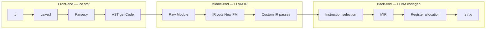

# lcc compiler learning & implementation plan

This is the **master plan** for studying and extending **lcc** across the full compiler stack:

| Layer | lcc today | This plan |
|-------|-----------|-----------|
| **Front-end** | flex/bison, AST, single-pass `genCode()` | Study track (complete); optional language deferrals in [Roadmap.md](Roadmap.md) |
| **Middle-end (IR)** | Raw IR via `IRBuilder`; `-O` via `PassBuilder` | Observability, custom New PM passes, pipeline control |
| **Back-end** | `TargetMachine` → `.o` (host triple) | Asm emission, target flags, MIR inspection |
| **Optimization** | LLVM default pipelines | Study classical opts, vectorization, optional benchmarks |

**How to use:** work through milestones **M0 → M18** in order. Each milestone has **Study**, **Implement**, and **Verify** steps. Skip optional milestones unless you want that depth.

Detailed middle/back-end acceptance criteria: [MiddleBackendRoadmap.md](MiddleBackendRoadmap.md).

Language-feature history (arrays, typedef, static, `-g`): [Roadmap.md](Roadmap.md) — **frontend roadmap complete**.

---

## Pipeline overview



**Key idea:** IR **generation** in lcc is **not** an LLVM pass — it is `AbstractSyntaxTree.cpp` + `Utils.cpp` calling `IRBuilder`. LLVM **passes** start after the module is built.

---

## Milestone checklist

Track progress here. Do not start the next milestone until **Verify** passes for the current one.

| ID | Milestone | Layer | Required? |
|----|-----------|-------|-----------|
| **M0** | [Environment & full test run](#m0-environment--full-test-run) | — | Yes |
| **M1** | [Compiler tour (one program)](#m1-compiler-tour-one-program) | Front-end | Yes |
| **M2** | [Pipeline map & LLVM tools](#m2-pipeline-map--llvm-tools) | All | Yes |
| **M3** | [IR generation study](#m3-ir-generation-study) | Front-end / IR | Yes |
| **M4** | [Pre/post IR dumps in lcc](#m4-prepost-ir-dumps-in-lcc) | Middle-end | Yes |
| **M5** | [Extract `IrOptimizer`](#m5-extract-iropimizer) | Middle-end | Yes |
| **M6** | [Custom New PM pass — instrumentation](#m6-custom-new-pm-pass--instrumentation) | Middle-end | Yes |
| **M7** | [Custom New PM pass — simple transform](#m7-custom-new-pm-pass--simple-transform) | Optimization | Optional |
| **M8** | [Pipeline control & `-O-passes`](#m8-pipeline-control--o-passes) | Optimization | Optional |
| **M9** | [Classical opts study (LLVM)](#m9-classical-opts-study-llvm) | Optimization | Yes |
| **M10** | [Extract `TargetBackend`; emit asm](#m10-extract-targetbackend-emit-asm) | Back-end | Yes |
| **M11** | [Target CLI flags](#m11-target-cli-flags) | Back-end | Yes |
| **M12** | [Codegen opt level & asm diff](#m12-codegen-opt-level--asm-diff) | Back-end | Yes |
| **M13** | [MIR inspection](#m13-mir-inspection) | Back-end | Optional |
| **M14** | [Vectorization study (LLVM)](#m14-vectorization-study-llvm) | Optimization | Yes |
| **M15** | [Benchmark harness](#m15-benchmark-harness) | Optimization | Optional |
| **M16** | [IR opt regression script](#m16-ir-opt-regression-script) | Middle-end | Optional |
| **M17** | [Machine pass (advanced)](#m17-machine-pass-advanced) | Back-end | Optional |
| **M18** | [Documentation & CI smoke](#m18-documentation--ci-smoke) | All | Yes |

**Estimated pace:** ~1–2 weeks per required milestone if part-time; M0–M2 can be done in a few days.

---

## Global rules (every milestone)

1. **Correctness first:** after any lcc code change, run the full suite:
   ```bash
   cd scripts
   ./compile-tests.sh && ./link-tests.sh && ./run-tests.sh
   ```
2. **Freeze the front-end** during M4–M15 unless a tiny new test file is needed (no grammar changes).
3. **One idea per milestone** — small PR-sized commits.
4. **Artifacts:** store IR/asm under `debug/` only when intentional; avoid noisy bulk diffs in git.
5. **Host target only** — x86_64 or ARM64 on your machine; no new hardware required.

---

## M0: Environment & full test run

**Goal:** Confirm build and 40-test regression.

| Step | Action |
|------|--------|
| Study | [Install.md](Install.md), [Testing.md](Testing.md) |
| Implement | `./build-lcc.sh`; full `./compile-tests.sh && ./link-tests.sh && ./run-tests.sh` |
| Verify | All tests `PASS`; `../../lcc-build/lcc` exists |

---

## M1: Compiler tour (one program)

**Goal:** Trace C → tokens → AST → IR for one file.

| Step | Action |
|------|--------|
| Study | Read `tests/0.hello_world.c` or `tests/12.arithmetic.c` |
| Study | `Lexer.l` (keywords), `Parser.y` (start symbol), `main.cpp` (pipeline) |
| Study | Open `debug/0.hello_world.dot` and `.debug.ll` |
| Implement | None (study only) |
| Verify | Can explain path: `yyparse` → `g_root` → `genIrCode` → `genObjectCode` |

**Recommended deep-dive files:** `AbstractSyntaxTree.hpp` (header comment), `VarDecl::genCode`, `FuncDecl::genCode`.

---

## M2: Pipeline map & LLVM tools

**Goal:** Use external LLVM tools on lcc output (independent of lcc changes).

| Step | Action |
|------|--------|
| Study | Compare `debug/25.quick_sort.debug.ll` vs `.release.ll` |
| Study | `docs/Usage.md` compile modes |
| Implement | Run on host (adjust paths):
   ```bash
   opt -passes='default<O2>' debug/25.quick_sort.debug.ll -S -o /tmp/opt.ll
   llc debug/25.quick_sort.release.ll -o /tmp/out.s
   llvm-objdump -d ../../lcc-build/25.quick_sort.o
   ```
| Verify | Can name three differences between debug and release IR |

---

## M3: IR generation study

**Goal:** Understand how lcc emits IR (not LLVM passes).

| Step | Action |
|------|--------|
| Study | `Utils.hpp` — casts, load/store, GEP, arithmetic |
| Study | Trace `ForStmt`, `IfStmt`, `Subscript` in `AbstractSyntaxTree.cpp` |
| Study | Opaque pointers: pointee types on `VarType`, not on `llvm::Type*` |
| Implement | Hand-write LLVM IR for `0.hello_world.c`; diff vs `.debug.ll` |
| Verify | Every instruction in `.debug.ll` maps to an AST `genCode()` path |

**Key tests:** `12.arithmetic.c`, `25.quick_sort.c`, `33.array_2d_decl.c`.

---

## M4: Pre/post IR dumps in lcc

**Goal:** See exactly what lcc emits vs what LLVM optimizes.

| Step | Action |
|------|--------|
| Implement | CLI flags, e.g. `-l-pre-opt` and `-l-post-opt` (or extend `-l` naming) |
| Implement | Dump raw IR **before** `optimizeCode()`; dump **after** |
| Verify | Full test suite PASS; two `.ll` files differ for `-O2` on `25.quick_sort.c` |

Details: [MiddleBackendRoadmap.md § M4](MiddleBackendRoadmap.md#m4-prepost-ir-dumps).

---

## M5: Extract `IrOptimizer`

**Goal:** Separate middle-end from `CodeGenerator`.

| Step | Action |
|------|--------|
| Implement | `src/IrOptimizer.hpp` / `IrOptimizer.cpp`; move `optimizeCode()` |
| Implement | `CodeGenerator::genIrCode` calls `IrOptimizer::run(...)` |
| Verify | Same IR behavior as before; full test suite PASS |

---

## M6: Custom New PM pass — instrumentation

**Goal:** Learn pass registration and the New Pass Manager.

| Step | Action |
|------|--------|
| Study | LLVM docs: Writing an LLVM Pass (New PM) |
| Implement | e.g. `CountLoadsPass` — print load/call counts per function |
| Implement | Register in pipeline **before or after** default opts (document choice) |
| Verify | Pass runs on all tests; no IR behavior change; suite PASS |

**Purpose:** microscope, not replacement optimizer.

---

## M7: Custom New PM pass — simple transform (optional)

**Goal:** Implement one classical idea on IR yourself.

| Step | Action |
|------|--------|
| Implement | e.g. local constant fold, trivial dead instruction removal, or `-instcombine`-like micro-pass on a subset |
| Verify | Suite PASS; post-opt IR differs; document what changed on `12.arithmetic.c` |

Skip if M6 satisfies your learning goals.

---

## M8: Pipeline control & `-O-passes` (optional)

**Goal:** Compose LLVM passes explicitly.

| Step | Action |
|------|--------|
| Implement | `-O-passes=mem2reg,instcombine,simplifycfg` or named presets |
| Verify | Preset reproduces subset of `-O2` on a small test |

---

## M9: Classical opts study (LLVM)

**Goal:** Know what `-O2` does without reimplementing it.

| Step | Action |
|------|--------|
| Study | Run `opt -passes='default<O2>' -debug-pass=structure` (or `-print-pipeline`) on `.debug.ll` |
| Study | Identify mem2reg, instcombine, GVN, loop passes on `25.quick_sort.c` |
| Implement | Notes doc or comments in `IrOptimizer.cpp` listing observed passes |
| Verify | Can explain SSA formation (mem2reg) on one function in pre/post IR |

---

## M10: Extract `TargetBackend`; emit asm

**Goal:** See machine code from lcc.

| Step | Action |
|------|--------|
| Implement | `src/TargetBackend.hpp` / `TargetBackend.cpp`; move `genObjectCode()` |
| Implement | `-S` / `--emit-assembly` → `.s` file |
| Verify | Asm generated for `12.arithmetic.c`; suite PASS |

---

## M11: Target CLI flags

**Goal:** Control triple, CPU, features on **host** target.

| Step | Action |
|------|--------|
| Implement | `--target=`, `-mcpu=`, `-mattr=+…` wired to `TargetMachine` |
| Verify | Asm changes when attrs change; suite PASS |

---

## M12: Codegen opt level & asm diff

**Goal:** Relate IR `-O` to backend output.

| Step | Action |
|------|--------|
| Implement | Pass optimization level to `TargetMachine` codegen opt |
| Study | Diff asm: `-O0` vs `-O2` on `25.quick_sort.c` hot function |
| Verify | `-O2` asm is shorter or uses better instructions; suite PASS |

---

## M13: MIR inspection (optional)

**Goal:** See machine IR and register allocation stage.

| Step | Action |
|------|--------|
| Study | `llc -stop-before=registerizer`, `-print-machineinstrs` on `.release.ll` |
| Study | Identify virtual vs physical registers before/after regalloc |
| Implement | None required in lcc |
| Verify | Can point to regalloc in LLVM’s pipeline diagram |

**Note:** MIR is used for **all** targets (x86_64, ARM64), not only “new hardware.”

---

## M14: Vectorization study (LLVM)

**Goal:** Study **auto-vectorization** via LLVM — not a custom vector pass in the base plan.

| Step | Action |
|------|--------|
| Study | Add or use loop-heavy test (e.g. array sum); compile `-O3` |
| Study | Compare asm with/without SIMD attrs (`-mattr=+avx2` on x86; NEON default on ARM64) |
| Study | Optional: `llvm-mca` on hot loop asm |
| Verify | Document whether LLVM vectorized and why/why not |

Custom loop vectorizer pass: **out of scope** unless you extend to M7-style research.

---

## M15: Benchmark harness (optional)

**Goal:** Compare opt levels and transforms where performance matters.

| Step | Action |
|------|--------|
| Implement | `scripts/bench-opt.sh` — time `-O0` vs `-O2`, with/without custom pass (M7) |
| Implement | Use `hyperfine` or `/usr/bin/time`; optional IR instruction count |
| Verify | Table in doc; CI runs smoke only (correctness), not flaky timing |

Instrument-only passes (M6): benchmark optional.

---

## M16: IR opt regression script (optional)

**Goal:** Catch unintended IR changes.

| Step | Action |
|------|--------|
| Implement | `scripts/check-ir-opt.sh` — instruction counts or diff vs golden `.release.ll` |
| Verify | Detects deliberate IR change; documented in [Testing.md](Testing.md) |

---

## M17: Machine pass (advanced, optional)

**Goal:** One `MachineFunctionPass` on host target — **not** custom regalloc.

| Step | Action |
|------|--------|
| Study | LLVM backend pass registration (separate from IR New PM) |
| Implement | Trivial machine peephole or counter on MIR |
| Verify | Asm/object still correct on one test |

Full register allocator: **out of scope**.

---

## M18: Documentation & CI smoke

**Goal:** Keep the repo teachable for the next reader.

| Step | Action |
|------|--------|
| Implement | Update [Usage.md](Usage.md) with new flags |
| Implement | Expand [Pipeline.md](Pipeline.md) — full tool recipes (`opt`, `llc`, `objdump`, `mca`) |
| Implement | CI: smoke `-S` on one test (extend `.github/workflows/linux.yml`) |
| Verify | [docs/README.md](README.md) links all plan docs |

---

## Front-end study track (existing codebase)

The **implementation** front-end roadmap is **complete** ([Roadmap.md](Roadmap.md)). New learners should still study:

| Topic | Where |
|-------|--------|
| LALR grammar | `Parser.y`, [Conflicts.md](Conflicts.md) |
| AST ownership | `AbstractSyntaxTree.hpp` header |
| Single-pass types | `getExprTypeId`, `getExprVarType` during `genCode()` |
| Debug info | `DebugInfoBuilder.cpp`, `-g` path |

Optional future **language** work (preprocessor, 3D arrays, `extern`) stays in [Roadmap.md](Roadmap.md) — **not** part of M0–M18.

---

## Tools reference

| Tool | Use |
|------|-----|
| `lcc -l-pre-opt` / `-l-post-opt` | Raw vs optimized IR (after M4) |
| `opt -passes='…'` | Experiment with pass pipelines |
| `llc` | IR → asm; MIR dumps with stop flags |
| `llvm-objdump -d` | Disassemble `.o` |
| `llvm-mca` | Analyze asm throughput (vectorization) |
| `llvm-dwarfdump` | Debug info ([check-debug-info.sh](../scripts/check-debug-info.sh)) |
| `dot` | Render AST graphs |

---

## Suggested reading

| Resource | Topic |
|----------|--------|
| [LLVM Language Reference](https://llvm.org/docs/LangRef.html) | IR instructions |
| [Writing an LLVM Pass (New PM)](https://llvm.org/docs/NewPassManager.html) | Custom passes (M6–M8) |
| [LLVM Target Triple](https://llvm.org/docs/LangRef.html#target-triple) | Backend flags (M11) |
| `AbstractSyntaxTree.hpp` comment block | lcc single-pass architecture |
| [Conflicts.md](Conflicts.md) | Parser ambiguities |

---

## Out of scope (all milestones)

| Item | Why |
|------|-----|
| New CPU / new LLVM backend target | Port project |
| Custom greedy register allocator | Research-scale |
| Full loop vectorizer implementation | Use LLVM’s |
| Preprocessor / 3D arrays | [Roadmap.md](Roadmap.md) deferrals |
| Merge `-g` with aggressive IR opts blindly | Breaks debuggability; see [Usage.md](Usage.md) |

---

## Related docs

| Document | Role |
|----------|------|
| [MiddleBackendRoadmap.md](MiddleBackendRoadmap.md) | Detailed implement/verify for M4–M17 |
| [Roadmap.md](Roadmap.md) | Front-end language features (done) |
| [Testing.md](Testing.md) | Scripts and compile modes |
| [Development.md](Development.md) | Debug lcc in LLDB |
| [Pipeline.md](Pipeline.md) | Tool cookbook (stub; expand at M18) |
