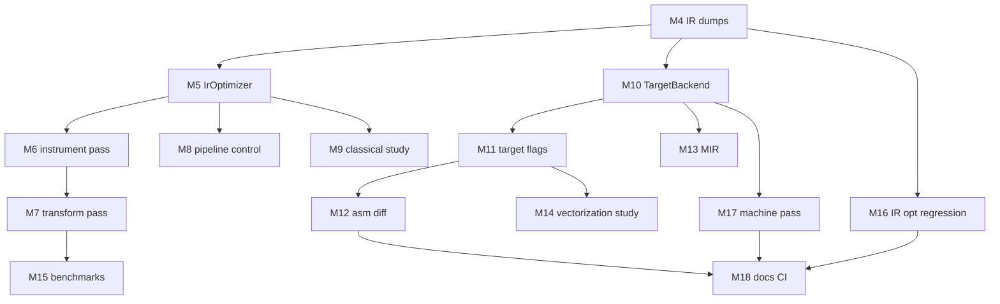

# Middle-end & back-end notes

Implementation details and acceptance criteria for [LearningPlan.md](LearningPlan.md) milestones **M4–M18**. All of them are implemented; each section below records what was built and how to verify it.

---

## Current baseline

| Component | File | Behavior |
| ----------- | ------ | ---------- |
| IR emission | `pipeline::genIr`, `irgen/ExprToIr.cpp`, `irgen/StmtToIr.cpp`, `irgen/Operators.cpp`, `irgen/TypeConversion.cpp` | AST walk → raw `llvm::Module` |
| IR optimization | `IrOptimizer::run` | `PassBuilder::buildPerModuleDefaultPipeline` |
| IR instrumentation | `IrInstructionStatsPass` (`-ir-stats`) | New PM function pass; no IR change |
| IR transform (optional) | `FoldAddZeroPass` (`-fold-add-zero`) | New PM function pass; M7 teaching peephole |
| Object emission | `TargetBackend::emitObject` via `pipeline::emitObject` | Host triple (or `--target`), `-mcpu`/`-mattr`, CLI `-O` → `CodeGenOptLevel`, PIC/PIE relocation model, legacy PM → `.o` |
| Assembly emission | `TargetBackend::emitAssembly` via `-S` | Same `TargetBackendOptions` as object emission |
| Machine instrumentation (optional) | `MachineInstrStatsPass` (`-machine-stats`) | Legacy MachineFunctionPass on final MIR; counts only, no codegen change |
| Debug info | `DebugInfoBuilder` | `-g` skips IR opts |
| Reference IR | `debug/*.{debug,release}.{pre,post}.ll`, `*.debug.ll`, `*.release.ll` | 43 tests × 2 modes |

Files the milestones added:

```
src/
  opt/
    IrOptimizer.hpp / IrOptimizer.cpp     ← M5
    passes/
      IrInstructionStatsPass.cpp          ← M6
      FoldAddZeroPass.cpp                 ← M7
  backend/
    TargetBackend.hpp / TargetBackend.cpp ← M10
    passes/
      MachineInstrStatsPass.cpp           ← M17 (legacy MachineFunctionPass)
```

---

## Layer map

| Layer | Built by | Custom pass? | Manager |
| ------- | ---------- | -------------- | --------- |
| IR generation | lcc `genCode()` | No | — |
| IR optimization | LLVM + optional yours | Yes (New PM) | `PassBuilder` / New PM |
| Codegen | LLVM `TargetMachine` | Optional MachineFunctionPass | Legacy PM in lcc today |
| Regalloc / machine opts | LLVM backend | Observe; don’t rewrite | Inside codegen PM |

---

## M4: Pre/post IR dumps

**Acceptance criteria**

- [x] New flags documented in [Usage.md](Usage.md)
- [x] Pre-opt dump equals former raw module output (after codegen, before opts)
- [x] Post-opt dump matches current `-O2` behavior when opts run
- [x] `-g` still skips optimization; pre/post dumps reflect finalize-only path
- [x] `-l` unchanged (dumps after object emission for test script compatibility)
- [x] Full `./compile-tests.sh && ./link-tests.sh && ./run-tests.sh` PASS

**Suggested CLI** (test scripts use `debug/<test>.<mode>.pre.ll` / `.post.ll`)

| Flag | Content |
| ------ | --------- |
| `-l-pre-opt <file>` | IR immediately after `root->genCode()` |
| `-l-post-opt <file>` | IR after `IrOptimizer::run()` and debug finalization (`-g`) |
| `-l <file>` | After `pipeline::emitObject()` in `main` (before optional `-S`; includes target metadata; test goldens) |

**Hook in `pipeline::genIr`** (after the AST walk, with the M5–M8 wiring):

```cpp
// options is the IrCodeGenOptions passed by main (see irgen/CodeGenerator.hpp).
if (!options.preOptIrPath.empty()) {
  dumpIr(generator.getModule(), options.preOptIrPath);
}

const std::string optLevel =
    options.generateDebugInfo ? std::string{} : options.optimizationLevel;
const std::string pipeline =
    options.generateDebugInfo ? std::string{} : options.customPipeline;
IrOptimizer{}.run(*module_, optLevel,
                  {.irStatsPath = options.irStatsPath,
                   .foldAddZero = options.foldAddZero,
                   .customPipeline = pipeline});
if (options.generateDebugInfo) {
  debugInfo_->finalize();
}

if (!options.postOptIrPath.empty()) {
  dumpIr(generator.getModule(), options.postOptIrPath);
}
```

`pipeline::genIr` always calls `IrOptimizer::run`; it no-ops unless at least one of `-O`, `-ir-stats`, `-fold-add-zero`, or `-O-passes` is set. With `-g`, both `optLevel` and the custom pipeline are blanked (LLVM opts skipped), but the custom passes still run. `-l` is dumped from `main` right after `pipeline::emitObject()` (before optional `-S`), not here.

**Verify**

```bash
../../lcc-build/lcc -O2 -i ../tests/25.quick_sort.c -o /tmp/q.o \
  -l-pre-opt /tmp/pre.ll -l-post-opt /tmp/post.ll
diff -u /tmp/pre.ll /tmp/post.ll | head
```

---

## M5: Extract `IrOptimizer`

**Acceptance criteria**

- [x] No behavior change vs former `optimizeCode()`
- [x] `irgen/CodeGenerator.cpp` shrinks; IR opt logic in `opt/IrOptimizer.cpp`
- [x] Full test suite PASS

**API** (current):

```cpp
struct IrOptimizerOptions {
  std::string irStatsPath;     // non-empty enables IrInstructionStatsPass; "-" = stderr
  bool foldAddZero = false;    // M7
  std::string customPipeline;  // M8: PassBuilder pipeline text or preset (e.g. O2-peephole)
};

class IrOptimizer {
 public:
  void run(llvm::Module& module, const std::string& optimizationLevel,
           const IrOptimizerOptions& options = {});
};
```

---

## M6: Custom New PM pass — instrumentation

**Acceptance criteria**

- [x] Pass linked into `lcc` binary
- [x] Stats via `-ir-stats <file>` (`-` = stderr)
- [x] No change to program semantics — all 41 tests PASS
- [x] Pass behind `-ir-stats` (disabled by default for compile-tests.sh)

**Implementation:** `IrInstructionStatsPass` (`src/opt/passes/`)

- Counts `load`, `store`, `call`/`invoke` per function; aggregates module totals
- Enabled only when `-ir-stats <file>` is passed (`-` writes to stderr)
- Inserted **before** `buildPerModuleDefaultPipeline` via `createModuleToFunctionPassAdaptor`

**Learning goals**

- `PassInfoMixin`, `PreservedAnalyses`
- Composing a custom pass with LLVM’s default pipeline in `ModulePassManager`

**Not in scope:** changing IR.

---

## M7: Custom New PM pass — simple transform (optional)

**Acceptance criteria**

- [x] Pass removes or folds a narrow class of redundant IR (`FoldAddZeroPass`: `add iN %x, 0` → `%x`)
- [x] All tests PASS (behavior preserved; flag disabled by default in `compile-tests.sh`)
- [x] Post-opt IR diff documented for `12.arithmetic.c` ([LlvmTools.md § M7](LlvmTools.md#custom-transform-pass-m7))
- [x] Optional: M15 benchmark shows no regression (or improvement) — `bench.sh --smoke`

**Implementation:** `FoldAddZeroPass` (`src/opt/passes/`), enabled with `-fold-add-zero` before the default LLVM pipeline.

---

## M8: Pipeline control (optional)

**Acceptance criteria**

- [x] `-O-passes mem2reg,instcombine,simplifycfg` runs named pipeline via `PassBuilder::parsePassPipeline`
- [x] Preset `O2-peephole` maps to the same three passes
- [x] Invalid pass name → clear error (`Invalid -O-passes pipeline "…": unknown pass name …`)
- [x] Documented interaction with `-O0`…`-O3` (mutually exclusive; `-g` skips both)

**Implementation:** `IrOptimizerOptions::customPipeline`; `-O-passes` / `--optimization-passes` in `driver/main.cpp`.

---

## M9: Classical opts study

**No lcc code required** beyond notes. Acceptance:

- [x] Listed passes that run at `-O2` on `25.quick_sort.c` ([LlvmTools.md](LlvmTools.md))
- [x] Identified mem2reg / SSA on `@partition` in pre/post dumps
- [x] Explained instcombine + DCE on `@swap` with IR snippets

**Commands** (LLVM 20; see [LlvmTools.md](LlvmTools.md) for full recipes):

```bash
../../lcc-build/lcc -O2 -i ../tests/25.quick_sort.c -o /tmp/q.o \
  -l-pre-opt /tmp/q-pre.ll -l-post-opt /tmp/q-post.ll
opt --print-pipeline-passes -passes='default<O2>' /tmp/q-pre.ll -disable-output
```

---

## M10: Extract `TargetBackend`; emit asm

**Acceptance criteria**

- [x] `-S <file>` writes assembly
- [x] `-o` still writes object (existing behavior)
- [x] Full test suite PASS

**API** (current; `triple` / `cpu` / `features` are wired to the CLI by M11, `optimizationLevel` by M12, `machineStatsPath` by M17):

```cpp
struct TargetBackendOptions {
  std::string triple;  // empty = host default
  std::string cpu = "generic";
  std::string features;
  std::string optimizationLevel;  // CLI -O → CodeGenOptLevel (M12)
  std::string machineStatsPath;   // non-empty splices MachineInstrStatsPass (M17)
};

class TargetBackend {
 public:
  void emitObject(llvm::Module& module, const std::string& path,
                  const TargetBackendOptions& options = {});
  void emitAssembly(llvm::Module& module, const std::string& path,
                    const TargetBackendOptions& options = {});
};
```

Use `llvm::CodeGenFileType::AssemblyFile` in `addPassesToEmitFile`.

---

## M11: Target CLI flags

**Acceptance criteria**

- [x] `--target <triple>` (default: host)
- [x] `-mcpu <cpu>` (default: `generic`)
- [x] `-mattr <features>` passed to `TargetMachine` (e.g. `+avx2,-sse4.1`)
- [x] Documented in Usage.md; suite PASS on host target

**Verify asm change**

```bash
# x86 example — adjust for your platform
../../lcc-build/lcc -O2 -i ../tests/12.arithmetic.c -o /tmp/a.o -S /tmp/a.s -mattr +avx2
```

---

## M12: Codegen opt level & asm diff

**Acceptance criteria**

- [x] `TargetMachine` codegen opt level matches CLI `-O` (see `CodeGenOptLevel` in `backend/TargetBackend.cpp`)
- [x] Saved asm for `25.quick_sort.c` at `-O0` and `-O2` under `debug/` (`*.debug.s` / `*.release.s` from `compile-tests.sh`)
- [x] Written comparison: instruction count and loop structure in hot function ([LlvmTools.md § M12](LlvmTools.md#codegen-opt-level--asm-diff-m12))

**Mapping:** CLI `-O` → `CodeGenOptLevel` is tabulated in [Usage.md § Optimization levels](Usage.md#optimization-levels--o); what each level changes in the back-end is in [LlvmTools.md § M12](LlvmTools.md#codegen-opt-level--asm-diff-m12).

**Verify asm diff**

```bash
# From lcc/scripts after compile-tests.sh (--debug = -g -O0, --release = -O2)
wc -l ../debug/25.quick_sort.debug.s ../debug/25.quick_sort.release.s
diff -u ../debug/25.quick_sort.debug.s ../debug/25.quick_sort.release.s | head
```

---

## M13: MIR inspection (optional)

**No lcc code required.**

```bash
# From lcc/scripts (LLVM 20)
source ./build-env.sh
./mir-study.sh
llc -O2 --stop-before=greedy ../debug/25.quick_sort.release.post.ll -o /tmp/q.pre-regalloc.mir
```

**Acceptance**

- [x] Notes: virtual registers (`%15:gpr64common`) before `greedy`; physical (`$w9`) after `prologepilog` — [LlvmTools.md § M13](LlvmTools.md#mir-inspection-m13)
- [x] Can name where MIR sits in pipeline (after ISel, before asm; regalloc = `greedy` pass)

---

## M14: Vectorization study

**Acceptance criteria**

- [x] Loop-heavy test compiled at `-O3` (`tests/40.array_sum.c`; study-only, not in compile-tests.sh)
- [x] Asm inspected for SIMD ops (platform-dependent; see [LlvmTools.md § M14](LlvmTools.md#auto-vectorization-study-m14))
- [x] Short write-up: vectorized or not, and LLVM reason (cost model without TM in IrOptimizer; quick_sort control flow)
- [x] Optional: `llvm-mca` recipe on scalar loop asm in LlvmTools.md

**Not required:** custom vectorization pass. LLVM `LoopVectorizer` / `SLPVectorizer` run via `-O3` pipeline.

---

## M15: Benchmark harness (optional)

**Script:** `scripts/bench.sh` — compile time, IR count, and runtime on `benchmarks/` workloads

**Docs:** [Benchmarks.md](Benchmarks.md) — programs, variants, usage, results log

| Variant | Purpose |
|---------|---------|
| `-O0` vs `-O2` | LLVM opt impact (compile time, IR count, runtime) |
| With vs without `-fold-add-zero` | Custom transform impact on benchmark workloads |

No `-mcpu` variant: lcc defaults to LLVM's `generic` CPU, so `-mcpu generic` matches plain `-O2`. Host-specific CPUs are a manual study (see [Benchmarks.md](Benchmarks.md)).

**Metrics** (see [Benchmarks.md](Benchmarks.md))

- Compile and runtime wall time — averaged over `--runs` (default 10) via `/usr/bin/time`
- Post-opt IR instruction count from `-l-post-opt`

**CI:** `./bench.sh --smoke` — compile/link/run each variant; **no timing gate**.

---

## M16: IR opt regression script (optional)

**Script:** `scripts/check-ir-opt.sh` — recompiles each test at `-O2` into a temp dir and compares the IR against committed `debug/` goldens.

**Acceptance criteria**

- [x] Count mode (default): post-opt IR instruction count vs `debug/*.release.post.ll`
- [x] `--diff`: full textual diff of post-opt IR vs `debug/*.release.post.ll` (host-portable; no target metadata)
- [x] `--release`: full diff of final IR vs `debug/*.release.ll`, ignoring `target datalayout` / `target triple`
- [x] Detects a deliberate IR change and exits non-zero; single-test argument supported
- [x] Documented in [Testing.md](Testing.md#ir-optimization-regression-check-m16)

---

## M17: Machine pass (advanced, optional)

**Script/pass:** `src/backend/passes/MachineInstrStatsPass.{hpp,cpp}` — a legacy `MachineFunctionPass` that counts machine instructions on fully lowered MIR (post-regalloc). Enabled with `-machine-stats <file>` (`-` = stderr).

**Acceptance**

- [x] One pass at machine layer on host target (`MachineInstrStatsPass`, spliced before the AsmPrinter)
- [x] Does not break object correctness — object/asm byte-identical with vs without `-machine-stats` (analysis-only: `runOnMachineFunction` returns false, `getAnalysisUsage` = `setPreservesAll`); full suite PASS
- [x] Documented separately from IR New PM (different registration): legacy PM + `TargetPassConfig` in `TargetBackend`, not `PassBuilder` — see [LlvmTools.md § M17](LlvmTools.md#machine-function-pass-m17)
- [x] CI smoke (`check-machine-pass-smoke.sh`) exercises the hand-rolled pipeline on every matrix platform and asserts the object is byte-identical with vs without `-machine-stats`

**Registration:** default emission uses `TargetMachine::addPassesToEmitFile`. When `-machine-stats` is set, the file-local `addEmitPassesWithMachineStats` helper in `backend/TargetBackend.cpp` drives the codegen pipeline by hand (`createPassConfig` → `addISelPasses` → `addMachinePasses` → add pass → `addAsmPrinter` → `createFreeMachineFunctionPass`) so the machine pass runs on final MIR. Default path is unchanged, so committed `debug/*.s` / `.o` goldens are byte-identical.

**Out of scope for M17:** a custom register allocator (never planned), and any transforming machine pass — M17 is analysis-only. A transforming `MachineFunctionPass` is recorded under [Future directions](#future-directions-no-milestones) as unscheduled.

---

## M18: Documentation & CI smoke

**Acceptance criteria**

- [x] [Usage.md](Usage.md) documents all CLI flags (IR dumps, `-ir-stats`, `-machine-stats`, `-S`, target flags, `-O` middle/back-end split)
- [x] [LlvmTools.md](LlvmTools.md) — LLVM tool reference (`opt`, `llc`, `llvm-objdump`, `llvm-mca`, `llvm-dwarfdump`)
- [x] CI smoke in `.github/workflows/ci.yml` (Ubuntu 24.04 / 26.04 + macOS matrix): `check-debug-info.sh`, `check-asm-smoke.sh`, `check-machine-pass-smoke.sh` (M17 codegen path), `bench.sh --smoke`
- [x] [docs/README.md](README.md) links all plan docs and milestone index (M0–M18 complete)

---

## Suggested workflow per milestone

1. Create a branch / tag `milestone-MN`.
2. Implement minimal diff.
3. Run full test suite.
4. Update [Usage.md](Usage.md) if CLI changed.
5. Merge when the verify checklist is complete.

---

## Dependency graph



M10 can start after M4 (parallel with M5–M9 if IR dumps exist).

---

## Future directions (no milestones)

M4–M18 cover the middle/back-end learning goals, and the current compiler is sufficient for lcc's teaching purpose. The ideas below are recorded for reference only — **deliberately unscheduled, with no milestones attached** — for anyone who later wants to go deeper on optimization or codegen:

- **A transforming IR pass beyond `FoldAddZeroPass`** (M7): local constant folding, dead-store elimination, or a small CSE, written as a New PM pass.
- **Vectorization-candidate reporter** (M6-style): an analysis-only pass that flags loops LLVM could vectorize, without transforming them.
- **A transforming `MachineFunctionPass`** (M17 is analysis-only): a genuine MIR peephole, spliced through the same `TargetPassConfig` hook in `TargetBackend`.
- **LLVM optimization remarks** (`-pass-remarks` / `-Rpass`): surface *why* loops did or didn't vectorize or inline.

These would extend, but do not block, the completed plan. A custom register allocator and a full loop vectorizer remain **out of scope** (use LLVM's). Front-end **diagnostics** and **language** ideas live in [FrontendNotes.md § Future directions](FrontendNotes.md#future-directions-no-milestones).

---

## Related docs

- [LearningPlan.md](LearningPlan.md) — master milestone list
- [FrontendNotes.md](FrontendNotes.md) — front-end language features (done)
- [LlvmTools.md](LlvmTools.md) — pipeline, LLVM tools, and per-milestone case studies
- [Testing.md](Testing.md) — regression scripts
- [Usage.md](Usage.md) — CLI reference
