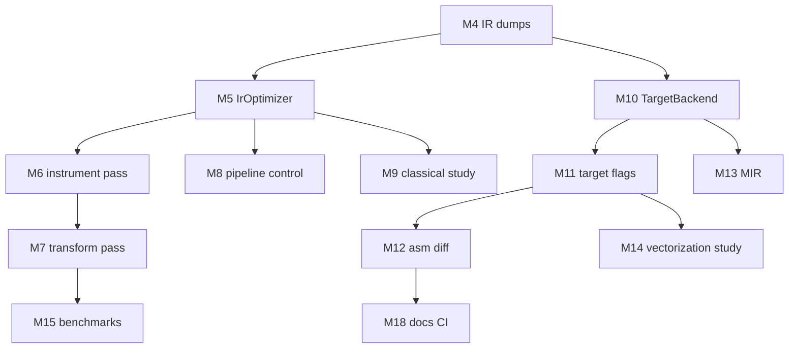

# Middle-end & back-end roadmap

Implementation details for [LearningPlan.md](LearningPlan.md) milestones **M4–M17**. The front-end language roadmap lives in [Roadmap.md](Roadmap.md) and is **complete**.

---

## Current baseline

| Component | File | Behavior |
|-----------|------|----------|
| IR emission | `CodeGenerator::genIrCode`, `AbstractSyntaxTree.cpp`, `Utils.cpp` | AST walk → raw `llvm::Module` |
| IR optimization | `CodeGenerator::optimizeCode` | `PassBuilder::buildPerModuleDefaultPipeline` |
| Object emission | `CodeGenerator::genObjectCode` | Default host triple, `cpu=generic`, legacy PM → `.o` |
| Debug info | `DebugInfoBuilder` | `-g` skips IR opts |
| Reference IR | `debug/*.debug.ll`, `*.release.ll` | 40 tests × 3 modes |

Target refactor layout (introduce incrementally):

```
src/
  IrOptimizer.hpp / IrOptimizer.cpp      ← M5 (done)
  TargetBackend.hpp / TargetBackend.cpp   ← M10
  passes/
    CountLoadsPass.cpp                    ← M6 (example)
```

---

## Layer map

| Layer | Built by | Custom pass? | Manager |
|-------|----------|--------------|---------|
| IR generation | lcc `genCode()` | No | — |
| IR optimization | LLVM + optional yours | Yes (New PM) | `PassBuilder` / New PM |
| Codegen | LLVM `TargetMachine` | Optional MachineFunctionPass | Legacy PM in lcc today |
| Regalloc / machine opts | LLVM backend | Observe; don’t rewrite | Inside codegen PM |

---

## M4: Pre/post IR dumps

**Status:** done

**Acceptance criteria**

- [x] New flags documented in [Usage.md](Usage.md)
- [x] Pre-opt dump equals former raw module output (after codegen, before opts)
- [x] Post-opt dump matches current `-O2` behavior when opts run
- [x] `-g` still skips optimization; pre/post dumps reflect finalize-only path
- [x] `-l` unchanged (dumps after object emission for test script compatibility)
- [x] Full `./compile-tests.sh && ./link-tests.sh && ./run-tests.sh` PASS

**Suggested CLI**

| Flag | Content |
|------|---------|
| `-l-pre-opt <file>` | IR immediately after `root->genCode()` |
| `-l-post-opt <file>` | IR after `IrOptimizer::run()` (or no-op if skipped) |
| `-l <file>` | Keep as alias for post-opt or pre-opt (document choice) |

**Suggested hook** (in `genIrCode` after AST walk, before optimize):

```cpp
if (!preOptPath.empty()) dumpModule(preOptPath);
if (!generateDebugInfo) irOptimizer.run(module, optimizationLevel);
else debugInfo_->finalize();
if (!postOptPath.empty()) dumpModule(postOptPath);
```

**Verify**

```bash
../../lcc-build/lcc -O2 -i ../tests/25.quick_sort.c -o /tmp/q.o \
  -l-pre-opt /tmp/pre.ll -l-post-opt /tmp/post.ll
diff -u /tmp/pre.ll /tmp/post.ll | head
```

---

## M5: Extract `IrOptimizer`

**Status:** done

**Acceptance criteria**

- [x] No behavior change vs former `optimizeCode()`
- [x] `CodeGenerator.cpp` shrinks; IR opt logic in `IrOptimizer.cpp`
- [x] Full test suite PASS

**API sketch**

```cpp
class IrOptimizer {
 public:
  void run(llvm::Module& module, const std::string& optimizationLevel);
  void runWithPasses(llvm::Module& module, llvm::StringRef pipeline);  // M8
};
```

---

## M6: Custom New PM pass — instrumentation

**Acceptance criteria**

- [ ] Pass linked into `lcc` binary (CMake may need extra LLVM components)
- [ ] Pass prints stats to stderr or `-pass-stats` file
- [ ] **No** change to program semantics — all 40 tests PASS
- [ ] Pass runs on every compilation (or behind `-enable-count-pass`)

**Example: `CountLoadsPass` (FunctionPass)**

- Count `load`, `store`, `call` instructions per function
- Print summary after pass runs

**Learning goals**

- `PassInfoMixin`, `PreservedAnalyses`
- Register with `PassBuilder::registerPipelineParsingCallback` or insert into default pipeline extension point

**Not in scope:** changing IR.

---

## M7: Custom New PM pass — simple transform (optional)

**Acceptance criteria**

- [ ] Pass removes or folds a narrow class of redundant IR
- [ ] All tests PASS (behavior preserved)
- [ ] Post-opt IR diff documented for `12.arithmetic.c`
- [ ] Optional: M15 benchmark shows no regression (or improvement)

**Example ideas**

| Pass | Idea |
|------|------|
| `FoldAddZeroPass` | `add i32 %x, 0` → `%x` |
| `EraseUnusedAllocaPass` | Remove allocas with no loads (careful with lifetimes) |
| `StripLifetimePass` | Teaching-only metadata strip |

Start smaller than LLVM’s `instcombine`.

---

## M8: Pipeline control (optional)

**Acceptance criteria**

- [ ] `-O-passes=mem2reg,instcombine,simplifycfg` runs named pipeline
- [ ] Invalid pass name → clear error
- [ ] Document interaction with `-O0`…`-O3` (mutually exclusive or override rules)

---

## M9: Classical opts study

**No lcc code required.** Acceptance = written notes or comments:

- [ ] Listed passes that run at `-O2` on `25.quick_sort.c`
- [ ] Identified mem2reg / SSA on one function in pre/post dump
- [ ] Explained one optimization (e.g. GVN or DCE) with IR snippet

**Commands**

```bash
opt -passes='default<O2>' -debug-pass=structure pre.ll -S -o /dev/null 2>&1 | less
```

---

## M10: Extract `TargetBackend`; emit asm

**Acceptance criteria**

- [ ] `-S <file>` writes assembly
- [ ] `-o` still writes object (existing behavior)
- [ ] Full test suite PASS

**API sketch**

```cpp
class TargetBackend {
 public:
  void emitObject(llvm::Module& module, llvm::StringRef path,
                  const TargetOptions& opts);
  void emitAssembly(llvm::Module& module, llvm::StringRef path,
                    const TargetOptions& opts);
};
```

Use `llvm::CodeGenFileType::AssemblyFile` in `addPassesToEmitFile`.

---

## M11: Target CLI flags

**Acceptance criteria**

- [ ] `--target=<triple>` (default: host)
- [ ] `-mcpu=<cpu>` (default: `generic`)
- [ ] `-mattr=+feat,-feat` parsed into `TargetMachine` features
- [ ] Documented in Usage.md; suite PASS on host target

**Verify asm change**

```bash
# x86 example — adjust for your platform
lcc -O2 -i ../tests/12.arithmetic.c -o /tmp/a.o -S /tmp/a.s -mattr=+avx2
```

---

## M12: Codegen opt level & asm diff

**Acceptance criteria**

- [ ] `TargetMachine` codegen opt level matches CLI `-O` (see `CodeGenOpt::Level`)
- [ ] Saved asm for `25.quick_sort.c` at `-O0` and `-O2` under `debug/` (optional, gitignored or one golden)
- [ ] Written comparison: instruction count or loop structure in hot function

---

## M13: MIR inspection (optional)

**No lcc code required.**

```bash
llc -stop-before=registerizer -print-machineinstrs post.ll -o /dev/null 2>&1 | less
```

**Acceptance**

- [ ] Screenshot or notes: virtual registers before regalloc
- [ ] Can name where MIR sits in pipeline (after ISel, before asm)

---

## M14: Vectorization study

**Acceptance**

- [ ] Loop-heavy test compiled at `-O3`
- [ ] Asm inspected for SIMD ops (platform-dependent)
- [ ] Short write-up: vectorized or not, and LLVM reason (trip count, alias, etc.)
- [ ] Optional: `llvm-mca` on inner loop

**Not required:** custom vectorization pass. LLVM `LoopVectorizer` / `SLPVectorizer` run via `-O3` pipeline.

**Optional stretch:** M6-style pass that **reports** loops that are candidates for vectorization (analysis only).

---

## M15: Benchmark harness (optional)

**Script:** `scripts/bench-opt.sh`

| Variant | Purpose |
|---------|---------|
| `-O0` vs `-O2` | LLVM opt impact |
| With vs without M7 pass | Custom transform impact |
| `-mcpu=native` vs `generic` | Backend impact |

**Metrics**

- Wall time (`hyperfine --min-runs 10`)
- Optional: IR instruction count from `opt -O2` output

**CI:** do not gate on timing; gate on PASS only.

---

## M16: IR opt regression script (optional)

**Script:** `scripts/check-ir-opt.sh`

- Count instructions in post-opt IR per test
- Or diff against committed `debug/*.release.ll` when `--release` mode used

---

## M17: Machine pass (advanced, optional)

**Acceptance**

- [ ] One pass at machine layer on host target
- [ ] Does not break object correctness on chosen test
- [ ] Documented separately from IR New PM (different registration)

**Out of scope:** custom register allocator.

---

## Suggested workflow per milestone

1. Create a branch / tag `milestone-MN`.
2. Implement minimal diff.
3. Run full test suite.
4. Update [Usage.md](Usage.md) if CLI changed.
5. Check off milestone in [LearningPlan.md](LearningPlan.md) table.
6. Merge when verify checklist complete.

---

## Dependency graph



M10 can start after M4 (parallel with M5–M9 if IR dumps exist).

---

## Related docs

- [LearningPlan.md](LearningPlan.md) — master milestone list
- [Roadmap.md](Roadmap.md) — front-end language features (done)
- [Pipeline.md](Pipeline.md) — pipeline & LLVM tools (stub until M18)
- [Testing.md](Testing.md) — regression scripts
- [Usage.md](Usage.md) — CLI reference
