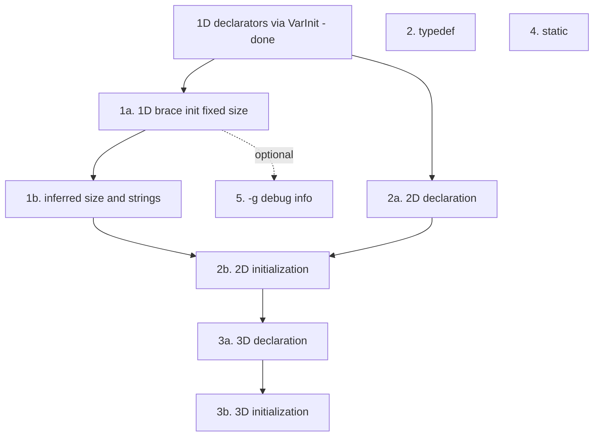

# lcc extension roadmap

This document prioritizes the features listed in the [README TODO](../README.md#todo). The order here follows **dependencies**, **learning value**, and **risk** — not the bullet order in the README.

lcc is a teaching compiler: each step should add one clear idea (grammar, AST, codegen, or LLVM metadata) without rewriting the whole pipeline.

## What lcc already has

Before extending, it helps to know what the current codebase already supports:

| Area | Status |
|------|--------|
| 1D array declaration | `int a[10];` through `VarType` + `VarList`; bounds on each `VarInit` (`ArrayBoundList`) |
| Mixed array/scalar lists | `int a[4], b;` in one declaration (`tests/30.array_mixed_decl.c`) |
| Array indexing | `arr[i]` via `Subscript` and `ArrayType` |
| Scalar initialization | `int x = 1;` in `VarDecl::genCode` (local `store`, global `Constant`) |
| Array brace initialization | **Not yet** — `int a[4] = {1,2,3}` and `int a[] = {…}` are planned |
| User-defined types | `struct`, `union`, `enum` with tag names (`DefinedType` lookup) |
| Type names in expressions | `_VarType: IDENTIFIER` for registered tags — **not** general `typedef` |
| `-g` CLI flag | Parsed in `main.cpp` — **not** passed to `CodeGenerator` yet |

See [Conflicts.md](Conflicts.md) for parser ambiguities that some roadmap items will touch (especially `typedef`).

---

## Recommended order (summary)

| Priority | Feature | Effort | Why this order |
|----------|---------|--------|----------------|
| **—** | [Array declarators](#array-extension-plan) (done) | Small | Unified `VarInit` + `ArrayBoundList`; foundation for init and multidim |
| **1** | [1D array initialization](#1d-array-initialization) | Medium | Brace init, inferred `[]`, string literals |
| **2** | [`typedef` and `size_t`](#2-typedef-and-size_t) | Medium–large | Idiomatic C types; identifier disambiguation |
| **3** | [2D and 3D arrays](#2d-and-3d-arrays) | Medium–large | Decl then init per dimension; cap at three dimensions |
| **4** | [`static`](#4-static) | Medium | Storage class / linkage |
| **5** | [`-g` debug info](#5--g-debug-info) | Medium–large | LLVM `DIBuilder` |

**Optional timing:** Step 5 is independent of language features. If you are debugging many new test programs with LLDB, consider implementing `-g` right after step 1 — it does not require new grammar rules.

---

## Dependency overview



---

## Array extension plan

C array initialization is intentionally split into small merges. **At most three dimensions.** Support legal forms in tiers; reject illegal forms (e.g. `char s[5] = "hello"`, `int a[][]`) once the matching feature is in scope.

| Step | Delivers | Tests (examples) |
|------|----------|------------------|
| **Declarators** (done) | `ArrayBound` / `ArrayBoundList` on `VarInit`; one `VarDecl` path; `int a[4], b;` | `tests/30.array_mixed_decl.c` |
| **1a** | `int a[4] = {1,2,3};` — zero-fill, global/local | fixed-size brace init |
| **1b** | `int a[] = {…};`, `char s[] = "hello";`, `char s[6] = "hello";` | reject `char s[5] = "hello"` |
| **2a** | `int a[8][5];`, subscript `a[i][j]` | declare only |
| **2b** | nested/flat init, `int a[][5] = {…}`, partial rows | reject `int a[][]`, `int b[8][]` |
| **3a** | `int a[2][8][5];` | declare only |
| **3b** | `int b[][8][5] = {…}` | first dimension inferred from init |

Grammar symbols: `VarInit`, `ArrayBound`, `ArrayBoundList` (see `Parser.y`). `VarInit::buildVarType()` nests `ArrayType` for each bound.

### Status: declarator unification (done)

- Removed the special-case `VarDecl` production that parsed `VarType IDENTIFIER [ INTEGER ] ;` alone.
- Array bounds live on each `VarInit`; `VarDecl::genCode` builds the effective type per variable.
- Scalar `= Expr` on arrays is rejected until brace initialization exists.

---

## 1D array initialization

Covers steps **1a** and **1b** below.

### 1a — fixed-size brace initialization

**Goal:**

```c
int arr[4] = {10, 7, 8, 9};   /* unspecified elements are zero */
int buf[3] = {1, 2, 3};
```

| Layer | Changes |
|-------|---------|
| **Parser** | `InitList` / `Initializer`; `VarInit` accepts `= { … }` |
| **AST** | Initializer list on `VarInit` |
| **Codegen** | `ConstantArray` or per-element `store`; zero-fill; size checks |

**Errors:** `int a[2] = {1, 2, 3};` (too many elements).

### 1b — inferred size and string literals

**Goal:**

```c
int arr[] = {10, 7, 8, 9, 1, 5};
char s1[] = "hello";
char s2[6] = "hello";
```

| Layer | Changes |
|-------|---------|
| **Parser** | `LBRACKET RBRACKET` on declarator when an initializer is present |
| **Codegen** | Infer length from brace list; string length includes `'\0'` |

**Errors:** `char s3[5] = "hello";` (initializer too long).

### Why before multidimensional init

1D flattening and zero-fill helpers are reused for 2D/3D brace initialization in steps 2b and 3b.

---

## 2. `typedef` and `size_t`

**Goal:** name types alias cleanly; support `size_t` as users expect.

```c
typedef unsigned long size_t;
typedef struct Node* NodePtr;
```

### Gap today

- No `typedef` keyword or typedef declaration rule.
- `IDENTIFIER` as a type only resolves through `DefinedType` for struct/union/enum tags already registered in the type table.
- README workaround: use `unsigned long` wherever `size_t` would appear.

### Work involved

| Layer | Changes |
|-------|---------|
| **Parser** | `typedef` declaration production; may increase type-vs-expr ambiguity — see [Conflicts.md](Conflicts.md) state 96 |
| **AST** | `TypedefDecl` (or extend `TypeDecl`) |
| **Symbol table** | Register alias name → `VarType*` in `CodeGenerator::addType` / lookup |
| **Disambiguation** | May need typedef scope tracking, `TYPENAME` token, or a small semantic pass — evaluate after first prototype |

### `size_t`

- **Preferred:** implement as `typedef unsigned long size_t;` once `typedef` works.
- **Shortcut:** add a builtin alias in the lexer/parser — fast, but teaches less.

### Why second

Many real C APIs use typedef’d names. Doing this before multidimensional arrays keeps declarators readable (`size_t buf[N]`). Expect more parser design work than array initializers.

---

## 2D and 3D arrays

Covers steps **2a**, **2b**, **3a**, and **3b**. Nested bounds already parse via `ArrayBoundList`; remaining work is validation, codegen for multi-subscript, and initialization.

### 2a — 2D declaration

```c
int matrix[8][5];
```

| Layer | Changes |
|-------|---------|
| **Codegen** | Verify nested `ArrayType` + double `Subscript` / GEP |
| **Tests** | `a[i][j]` assign and read |

### 2b — 2D initialization

```c
int a[8][5] = { {0,1,2}, {3,4,5} };
int a[8][5] = {0, 1, 2, 3, 4, 5 };
int a[][5] = { {1}, {2,3} };
```

**Errors:** `int a[][] = {…};`, `int b[8][] = {…};`

### 3a / 3b — 3D (maximum depth)

```c
int a[2][8][5];
int b[][8][5] = {
    { {1,2,3}, {4,5,6} },
    { {7,8,9}, {10,11,12} }
};
```

Only the **first** dimension may be omitted, and only when an initializer is present.

---

## 4. `static`

**Goal:** C storage class for file-local and function-local static variables (and optionally static functions).

```c
static int counter = 0;

void f(void) {
  static int once;
}
```

### Gap today

- README documents: use global variables instead of `static`.
- Globals use `ExternalLinkage`; locals are always stack `alloca`s.

### Work involved

| Layer | Changes |
|-------|---------|
| **Parser** | `STATIC` token; storage class on `VarDecl` / `FuncDecl` |
| **AST** | Storage-class field on declarations |
| **Codegen** | `llvm::GlobalValue::InternalLinkage` for file `static`; unique global symbols for local `static` with one-time init |

### Why fourth

Orthogonal to types and initializers. Teaches linkage and lifetime without blocking other features. README workarounds remain acceptable until this lands.

---

## 5. `-g` debug info

**Goal:** `lcc -g` embeds DWARF (or equivalent) in the object file so LLDB can single-step **generated** C programs.

### Gap today

- `main.cpp` defines `--generate-debug-info` / `-g`.
- The flag is **not** passed into `CodeGenerator`; `genObjectCode` emits code without debug metadata.

### Work involved

| Layer | Changes |
|-------|---------|
| **Driver** | Pass debug flag from `main.cpp` into `CodeGenerator` |
| **LLVM** | `DIBuilder`: compile unit, file/line, subprograms, local variables |
| **AST / codegen** | Optional: record source locations on nodes (`%locations` is already enabled in `Parser.y`) |

### Why fifth in the language roadmap

Pure infrastructure — no new C syntax. Valuable for debugging, but does not unlock new language tests. Reasonable to pull earlier if tooling pain is high during steps 1–4.

---

## Explicitly out of scope (for now)

These appear under “Except” in the README and are **not** on the near-term roadmap:

| Feature | Reason to defer |
|---------|-----------------|
| Preprocessing (`#include`, `#define`) | Separate pipeline stage; very large |
| `extern` variables | Linkage + multi-TU model; manual decls work today |
| Separate semantic-analysis pass | Add only when a feature requires it (e.g. heavy typedef disambiguation) — see architecture notes in `AbstractSyntaxTree.hpp` |
| Split `Expr` from `Stmt` | Large churn; low ROI unless rewriting the frontend for pedagogy |

---

## Suggested workflow per feature

For each roadmap item:

1. Add one or more tests under `tests/`.
2. Extend `Parser.y` / AST / codegen in that order (or AST first if grammar is obvious).
3. Run `./scripts/compile-tests.sh`, `link-tests.sh`, `run-tests.sh`.
4. Update README “supports” / “except” lists when the feature is done.
5. If parser conflicts change, note counts in [Conflicts.md](Conflicts.md).

---

## Related docs

- [README.md](../README.md) — supported features, TODO list, build and test commands
- [Conflicts.md](Conflicts.md) — Bison conflict analysis (relevant before `typedef`)
