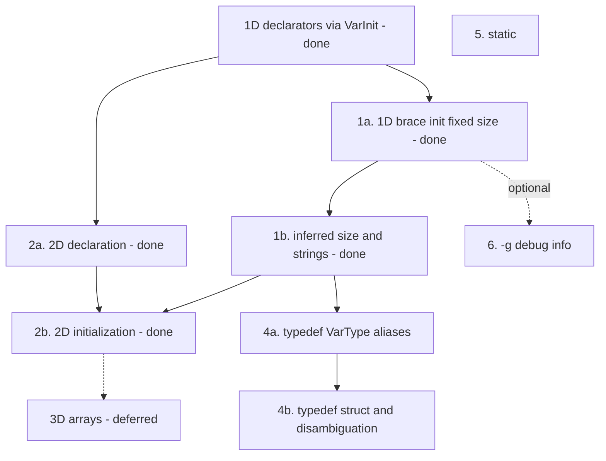

# lcc extension roadmap

This document prioritizes the features listed in the [README TODO](../README.md#todo). The order here follows **dependencies**, **learning value**, and **risk** — not the bullet order in the README.

lcc is a teaching compiler: each step should add one clear idea (grammar, AST, codegen, or LLVM metadata) without rewriting the whole pipeline.

## What lcc already has

Before extending, it helps to know what the current codebase already supports:

| Area | Status |
|------|--------|
| 1D array declaration | `int a[10];` through `VarType` + `VarList`; bounds on each `VarInit` (`ArrayBoundList`) |
| Mixed array/scalar lists | `int a[4], b;` in one declaration (`tests/30.array_mixed_decl.c`) |
| Array indexing | `arr[i]` via `Subscript` and `ArrayType` |
| Scalar initialization | `int x = 1;` in `VarDecl::genCode` (local `store`, global `Constant`) |
| 1D fixed-size brace initialization | `int a[4] = {1,2,3};`, `{}` zero-fill, global/local (`tests/31.array_1d_brace_init.c`) |
| Inferred `[]` and string literal init | `int a[] = {…}`, `char s[] = "hello"`, `char s[N] = "…"` (`tests/32.array_1d_inferred_string_init.c`) |
| 2D array declaration | `int m[8][5];`, `m[i][j]`, struct grids, mixed lists (`tests/33.array_2d_decl.c`) |
| 2D array brace initialization | nested/flat init, `int a[][5] = {…}` (`tests/34.array_2d_brace_init.c`) |
| `typedef` of `VarType` spellings | `typedef unsigned long size_t;`, pointer/builtin aliases (`tests/35.typedef_builtin.c`) |
| `typedef` struct aliases / disambiguation | **Not yet** — planned as step 4b |
| User-defined types | `struct`, `union`, `enum` with tag names (`DefinedType` lookup) |
| Type names in expressions | `_VarType: IDENTIFIER` for registered tags and typedef aliases |
| `-g` CLI flag | Parsed in `main.cpp` — **not** passed to `CodeGenerator` yet |

See [Conflicts.md](Conflicts.md) for parser ambiguities that some roadmap items will touch (especially `typedef`).

---

## Recommended order (summary)

| Priority | Feature | Effort | Why this order |
|----------|---------|--------|----------------|
| **—** | [Array declarators](#array-extension-plan) (done) | Small | Unified `VarInit` + `ArrayBoundList`; foundation for init and multidim |
| **1** | [1D array initialization](#1d-array-initialization) (done) | Medium | Brace init, inferred `[]`, string literals |
| **2** | [`typedef` and `size_t`](#4-typedef-and-size_t) | Medium–large | 4a done; 4b (struct typedefs) next |
| **—** | [3D arrays](#3d-arrays-deferred) | — | Deferred; 2D covers teaching goals for now |
| **3** | [`static`](#5-static) | Medium | Storage class / linkage |
| **4** | [`-g` debug info](#6--g-debug-info) | Medium–large | LLVM `DIBuilder` |

**Optional timing:** Step 5 is independent of language features. If you are debugging many new test programs with LLDB, consider implementing `-g` right after step 1 — it does not require new grammar rules.

---

## Dependency overview



---

## Array extension plan

C array initialization is intentionally split into small merges. **2D is complete; 3D is deferred.** Support legal forms in tiers; reject illegal forms (e.g. `char s[5] = "hello"`, `int a[][]`) once the matching feature is in scope.

| Step | Delivers | Tests (examples) |
|------|----------|------------------|
| **Declarators** (done) | `ArrayBound` / `ArrayBoundList` on `VarInit`; one `VarDecl` path; `int a[4], b;` | `tests/30.array_mixed_decl.c` |
| **1a** (done) | `int a[4] = {1,2,3};` — zero-fill, global/local | `tests/31.array_1d_brace_init.c` |
| **1b** (done) | `int a[] = {…};`, `char s[] = "hello";`, `char s[6] = "hello";` | `tests/32.array_1d_inferred_string_init.c`; reject `char s[5] = "hello"` |
| **2a** (done) | `int a[8][5];`, subscript `a[i][j]` | `tests/33.array_2d_decl.c` |
| **2b** (done) | nested/flat init, `int a[][5] = {…}`, partial rows | `tests/34.array_2d_brace_init.c`; reject `int a[][]`, `int b[8][]` |
| **3a / 3b** | *deferred* | 3D declaration and initialization — not planned near-term |

Grammar symbols: `VarInit`, `ArrayBound`, `ArrayBoundList` (see `Parser.y`). `VarInit::buildVarType()` nests `ArrayType` for each bound (innermost bound last in the declarator list).

### Status: 2D declaration (done)

- `buildVarType` applies `ArrayBoundList` outside-in so `int m[2][3]` becomes LLVM `[2 x [3 x T]]`.
- Nested `Subscript` and `CreateGEP` in `Utils::createAdd` / `createLoad` handle `a[i][j]` on locals, globals, and struct element grids.
- `tests/33.array_2d_decl.c`.

### Status: declarator unification (done)

- Removed the special-case `VarDecl` production that parsed `VarType IDENTIFIER [ INTEGER ] ;` alone.
- Array bounds live on each `VarInit`; `VarDecl::genCode` builds the effective type per variable.
- Scalar `= Expr` on arrays is rejected; use brace initialization for arrays.

### Status: fixed-size brace initialization (done)

- `InitList` on `VarInit`; `= { … }` and `= {}` in `Parser.y` (`%prec COMMA` so commas are not parsed as the comma operator).
- `buildGlobalArrayInitializer` / `storeLocalArrayInitializer` in `VarDecl::genCode`; zero-fill; reject too many elements and multidimensional brace init.
- `tests/31.array_1d_brace_init.c`.

---

## 1D array initialization

Steps **1a** and **1b** are done. See [Array extension plan](#array-extension-plan).

### 1a — fixed-size brace initialization (done)

**Goal:**

```c
int arr[4] = {10, 7, 8, 9};   /* unspecified elements are zero */
int buf[3] = {1, 2, 3};
```

Delivered as described in [Array extension plan](#array-extension-plan) step 1a.

### 1b — inferred size and string literals (done)

**Goal:**

```c
int arr[] = {10, 7, 8, 9, 1, 5};
char s1[] = "hello";
char s2[6] = "hello";
```

- `ArrayBound`: `LBRACKET RBRACKET` stores `kInferredArrayBound`; `resolveArrayBounds` infers length from brace list or string (`strlen + 1`).
- String init copies bytes plus `'\0'` into the char array; rejects initializer longer than the declared bound.

**Errors:** `char s3[5] = "hello";` (initializer too long).

### Why before multidimensional init

1D flattening and zero-fill helpers are reused for 2D/3D brace initialization in steps 2b and 3b.

---

## 4. `typedef` and `size_t`

Split into **4a** (grammar + alias table + `VarType` spellings) and **4b** (defined-type typedefs + expression disambiguation). `size_t` ships in **4a** via `typedef unsigned long size_t;`.

### Gap today

- No `typedef` keyword or typedef declaration rule.
- `IDENTIFIER` as a type only resolves through `DefinedType` for struct/union/enum tags already registered in the type table.
- README workaround: use `unsigned long` wherever `size_t` would appear.

### 4a — `typedef` of `VarType` spellings (including `size_t`) — **done**

**Goal:**

```c
typedef unsigned long size_t;
typedef int counter_t;
typedef int* IntPtr;

size_t nbytes = 0;
counter_t count = 1;
IntPtr p;
```

| Layer | Changes |
|-------|---------|
| **Lexer** | `TYPEDEF` token |
| **Parser** | `TypedefDecl: TYPEDEF VarType IDENTIFIER SEMICOLON` |
| **AST** | `TypedefDecl` (alias name + underlying `VarType*`) |
| **Codegen** | Typedef alias table; `DefinedType` lookup checks aliases before struct tags |

**Tests:** `tests/35.typedef_builtin.c` — builtin and pointer typedefs, `sizeof(size_t)`, use in params.

**In scope:** any type already parsed by `_VarType` (builtins, `const`, pointers, struct/union/enum tags that already exist).

**Out of scope for 4a:** typedef-as-declarator edge cases; fixing all State 96 identifier conflicts.

### 4b — defined-type typedefs and disambiguation

**Goal:**

```c
typedef struct Employee Employee;
typedef struct Employee* EmployeePtr;

void* malloc(size_t size);
unsigned long strlen(const char* s);
```

| Layer | Changes |
|-------|---------|
| **Parser / AST** | Combined typedef patterns where helpful (`typedef struct S { … } S;`) if needed |
| **Symbol table** | Typedef names visible in type positions; document expression-position limits |
| **Disambiguation** | Reduce wrong parses when a typedef name could be a variable (State 96 — see [Conflicts.md](Conflicts.md)) |
| **Tests** | Struct tag alias, pointer typedef, real API-style `size_t` / `malloc` / `strlen` declarations |

**Errors / limits:** typedef name used as a variable in the same scope; shadowing — document or reject explicitly.

### Why split 4a / 4b

- **4a** is one grammar rule plus alias lookup — enough for `size_t` and most numeric/pointer typedefs.
- **4b** touches struct tags, API conventions, and the hardest parser conflicts — better as a focused follow-up.

### Why before 3D and `static`

Typedef improves readability of array and API tests (`size_t buf[N]`) without another dimension of initializer complexity. 3D arrays are deferred; 2D init reuse does not require 3D.

---

## 2D and 3D arrays

Covers steps **2a** and **2b** (done). **3a / 3b** are deferred — see [3D arrays (deferred)](#3d-arrays-deferred).

### 2a — 2D declaration (done)

```c
int matrix[8][5];
```

Nested `ArrayType` layout and double subscript codegen were verified; `buildVarType` now maps declarator bounds to LLVM dimensions in outside-in order.

### 2b — 2D initialization (done)

```c
int a[8][5] = { {0,1,2}, {3,4,5} };
int a[8][5] = {0, 1, 2, 3, 4, 5 };
int a[][5] = { {1}, {2,3} };
```

- `InitElement` supports nested `InitList` in the parser; flatten row-major with zero-fill.
- Only the first dimension may be inferred (`int a[][5]`); reject `int a[][]` and `int b[8][]`.

### 3D arrays (deferred)

3D declaration (`int a[2][8][5];`) and initialization are **not** planned near-term. Nested `ArrayBoundList` already parses three bounds; codegen would extend the 2D flatten/GEP helpers.

---

## 5. `static`

**Goal:** C storage class for file-local and function-local static variables (and optionally static functions).

```c
static int counter = 0;

void f(void) {
  static int once;
}
```

### Gap today

- README documents: use global variables instead of `static`.
- Globals use `ExternalLinkage`; locals are always stack `alloca`s.

### Work involved

| Layer | Changes |
|-------|---------|
| **Parser** | `STATIC` token; storage class on `VarDecl` / `FuncDecl` |
| **AST** | Storage-class field on declarations |
| **Codegen** | `llvm::GlobalValue::InternalLinkage` for file `static`; unique global symbols for local `static` with one-time init |

### Why after typedef

Orthogonal to types and initializers. Teaches linkage and lifetime without blocking typedef work. README workarounds remain acceptable until this lands.

---

## 6. `-g` debug info

**Goal:** `lcc -g` embeds DWARF (or equivalent) in the object file so LLDB can single-step **generated** C programs.

### Gap today

- `main.cpp` defines `--generate-debug-info` / `-g`.
- The flag is **not** passed into `CodeGenerator`; `genObjectCode` emits code without debug metadata.

### Work involved

| Layer | Changes |
|-------|---------|
| **Driver** | Pass debug flag from `main.cpp` into `CodeGenerator` |
| **LLVM** | `DIBuilder`: compile unit, file/line, subprograms, local variables |
| **AST / codegen** | Optional: record source locations on nodes (`%locations` is already enabled in `Parser.y`) |

### Why fifth in the language roadmap

Pure infrastructure — no new C syntax. Valuable for debugging, but does not unlock new language tests. Reasonable to pull earlier if tooling pain is high during steps 1–4.

---

## Explicitly out of scope (for now)

These appear under “Except” in the README and are **not** on the near-term roadmap:

| Feature | Reason to defer |
|---------|-----------------|
| Preprocessing (`#include`, `#define`) | Separate pipeline stage; very large |
| `extern` variables | Linkage + multi-TU model; manual decls work today |
| Separate semantic-analysis pass | Add only when a feature requires it (e.g. heavy typedef disambiguation) — see architecture notes in `AbstractSyntaxTree.hpp` |
| Split `Expr` from `Stmt` | Large churn; low ROI unless rewriting the frontend for pedagogy |
| 3D arrays (3a / 3b) | 2D covers multidim teaching goals; high complexity for diminishing returns |

---

## Suggested workflow per feature

For each roadmap item:

1. Add one or more tests under `tests/`.
2. Extend `Parser.y` / AST / codegen in that order (or AST first if grammar is obvious).
3. Run `./scripts/compile-tests.sh`, `link-tests.sh`, `run-tests.sh`.
4. Update README “supports” / “except” lists when the feature is done.
5. If parser conflicts change, note counts in [Conflicts.md](Conflicts.md).

---

## Related docs

- [README.md](../README.md) — supported features, TODO list, build and test commands
- [Conflicts.md](Conflicts.md) — Bison conflict analysis (relevant before `typedef`)
